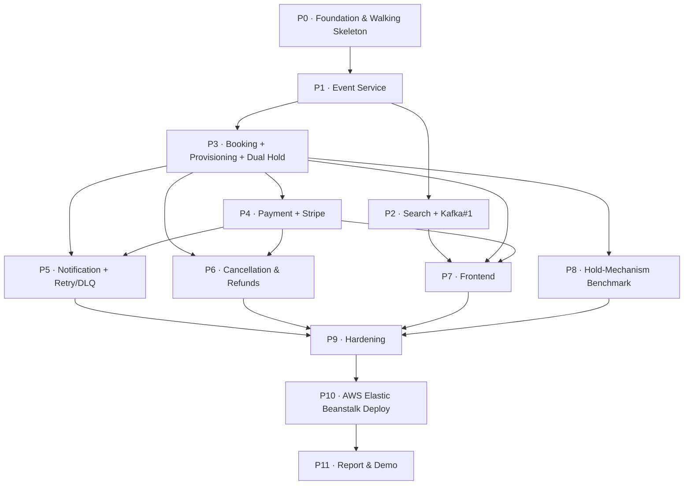

# Master Development Plan — Event Ticketing/Booking Platform

**Plan status: FINAL** — sequence and workstreams locked (report-first, benchmark-after-booking, continuous report drafting). Ready to execute Phase 0.

**Build status: PLANNED.** Everything in this document is *proposed sequence and scope of work*. Nothing here is Implemented, Tested, Measured, or Deployed yet. Status labels below follow the project's integrity rule and only ever advance through real work in Claude Code.

**Status legend (per phase task):** Planned → Implemented → Tested → Deployed → Measured → Verified. No number, test result, or "works" claim enters the report until it has actually reached the corresponding label through real execution.

**Companion artifact:** `decisions-log.md` (§1–26, locked). This plan is downstream of it — it does not re-decide anything, it sequences the build of what was decided.

---

## 0. How this plan relates to your two flows

Your **Flow 1** (Decision Log → Architecture → Feature Decomposition → Phases → Dependencies → Tasks → Testing → Validation → Claude Code Tasks) is exactly the pipeline that produced this document — with two corrections:

- **Testing and Validation are not terminal stages.** They are *per-phase exit criteria* (see each phase's "Validation checkpoint"). A phase is not done until its checkpoint passes.
- **One stage was missing: Report-Evidence Capture.** For a graded capstone the report is a first-class output. Every phase below names the report artifact it produces (see the "Report evidence" row and §16 for the full map).

Your **Flow 2** (the per-phase loop) is the correct *cadence*, refined below (§2). It runs once per phase.

---

## 1. Architecture recap (the shape the phases build)

Seven runtime components + frontend, all in one monorepo (§20), all behind Traefik:

- **Traefik** — API gateway, Docker-label service discovery (§5)
- **Keycloak** — identity provider, dev mode (§5); realm roles `user` / `organizer` (§15)
- **Event Service** — Postgres (`event_db`) + MongoDB seat maps; organizer writes (§4, §8, §15)
- **Search Service** — Elasticsearch index, Kafka-fed, not a source of truth (§4, §8)
- **Booking Service** — Postgres (`booking_db`); tickets, bookings, dual hold strategy (§4, §6, §21)
- **Payment Service** — Postgres (`payment_db`); Stripe test mode, refunds (§4, §9, §22)
- **Notification Service** — no DB / delivery log; retry + DLQ (§4, §17)
- **Frontend** — minimal React, 5 screens, Nginx-served (§10, §23)

Cross-service integration is exclusively the **five Kafka points** (§7) — no shared DBs, no distributed transactions (§8). Every consumer is idempotent (§7).

---

## 2. Per-phase cadence (refined Flow 2)

Every phase runs this loop once:

1. **PLAN** — turn the phase's task table into concrete Claude Code prompts (in a planning chat here, not Claude Code).
2. **REVIEW PLAN** — sanity-check task boundaries, dependencies, and acceptance criteria before writing code.
3. **IMPLEMENT** — Claude Code against the real repo. **Commit continuously here** — small, green commits, not one big commit at the end.
4. **TEST** — unit (pytest + `TestClient`) inline with implementation; integration (`testcontainers`) for anything touching a real Postgres/Kafka/Redis/ES. For Kafka phases, explicitly test *redelivery is a safe no-op* (§7).
5. **REVIEW** — architecture/code review against the decisions log invariants (idempotency keys, ownership scoping, no cross-service DB access, hold-release reuse).
6. **DOCUMENT** — **draft the report section this phase feeds** (§16), not just collect evidence: fold the diagram/screenshot/measured output straight into the report draft while it's fresh, so P11 is assembly rather than first-drafting. Also log any decisions-log delta — if a build reality contradicts a decision, log it, don't silently diverge.
7. **CHECKPOINT (git)** — tag/merge to `main` at the phase boundary. This is the only "end-of-phase" git event; the real commits happened in step 3.

---

## 3. Phase dependency graph

**Critical path (deploy spine):** P0 → P1 → P3 → P4 → P6 → P9 → P10 → P11.
**Report-critical branch:** P8 (benchmark) hangs off P3 but *must* land before P11 — it is the Feature Development Process centerpiece.
**Parallelizable:** P2 (after P1), P5 (after P3+P4), P7 (after P2/P3/P4) can slot into slack around the spine.

---

## 3B. North star, capacity & showcase milestones

**North star:** at any point toward end-September, have a coherent, working slice to showcase — build on solid bases and keep thickening. Being *always demoable* outranks completeness. Whatever percentage is ready at presentation time is what gets presented.

**Capacity:** 2 hrs every evening, starting **Aug 13, 2026**. Nominal 7 days/week = 14 hrs/week; realistic (one likely slip evening per week, plus debugging nights on the hard phases where 2 hrs yields little) ≈ **12 hrs/week**.

**Reference effort:** ~163 hrs total "with Claude Code" (Stryker's own breakdown). Caveat: cancellation/refunds (P6) and dedicated hardening (P9) aren't cleanly line-itemed there, and "Testing + report writing = 17 hrs" is optimistic for a 40-page report — so the true total is more like **~170–185 hrs**. Treat 163 as the floor.

**What the calendar actually yields:**

| Checkpoint | Elapsed | Hrs @ 7/7 | Hrs @ 6/7 | ≈ % of build |
|---|---|---|---|---|
| **Sep 21** (end of wk-3 Sep) | ~5.7 wks | ~80 | ~68 | **~42–49%** |
| **Sep 30** | ~7 wks | ~98 | ~84 | **~50–60%** |
| Full completion | ~11–14 wks | — | — | **~early–mid Nov** |

End-of-September lands at **~50–60% — exactly the stated fallback band.** September is the *presentable-partial* checkpoint; full completion (all phases + AWS + 40-page report) is ~early-to-mid November.

**Answer to "is 3rd week of September a good showcase time?"** Yes, with a calibrated expectation of *what* is showable. By ~Sep 21 you'll have the front half — foundation, event, search, and the concurrency-safe booking core, with the benchmark essentially measured under the resequence below. The complete book→pay→confirm loop lands ~end-Sep/early-Oct. Sep 21 is a strong *backend* showcase (architecture + hardest problem solved + measured numbers); end-of-Sep adds the full product loop.

### Locked sequence (report-first — DECIDED)

The **benchmark (P8) runs immediately after Booking (P3)**, ahead of Payment (P4). It is the report's only *Measured* chapter and needs only Booking's two hold strategies — nothing downstream — so running it right after P3 secures the strongest chapter by ~Sep 21–22, inside the showcase window. **Decision:** a report-with-benchmark ready by the end of September's 3rd week outranks having the full payment loop demoable early. The showcase deliverable is a *report alongside a working core*, not a polished product demo.

**Locked order:** `P0 → P1 → P2 → P3 → P8 → P4 → P6 → P5 → P7 → P10 → P9/P11`

### Showcase milestones (always-demoable checkpoints)

| Milestone | After | Cum hrs | What you can demo |
|---|---|---|---|
| **A · Architecture** | P0–P2 | ~33 | Login (Keycloak) → organizer creates event → Kafka → searchable. Auth + 2 services + Kafka + ES + Postgres + Mongo. |
| **B · Report centerpiece** | +P3, P8 | ~83 | Concurrency-safe seat holding (no double-booking) under load + **measured** cron-vs-Redis benchmark. *(≈ Sep 21–22)* |
| **C · Core product loop** | +P4, P6 | ~110 | book → pay (Stripe test) → CONFIRMED; cancel → refund → seat released. *(≈ early Oct)* |
| **D · Resilience** | +P5 | ~126 | Payment-failure immediate hold release + notification retry ladder → DLQ. |
| **E · Polished demo** | +P7 | ~144 | Full click-path through the React UI + interactive seat map. |
| **F · Deployed** | +P10 | ~153 | Same stack running on Elastic Beanstalk. |

### Report as a parallel workstream (DECIDED)

The report is **not** a final phase — it is drafted continuously, one section per milestone, while the material is fresh and honest. P11 collapses to an *assembly + formatting pass*, not first-drafting. Each milestone brings its mapped report sections (§16) to draft-complete:

| Milestone | Report sections reaching draft-complete |
|---|---|
| **A · Architecture** | Project Description; Requirement Gathering; Class Diagrams + Schema (Event, Search); Technologies Used (Keycloak, Traefik, Kafka, Postgres, Mongo, Elasticsearch) |
| **B · Benchmark** | **Feature Development Process — the measured cron-vs-Redis centerpiece**; Booking class diagram + schema |
| **C · Core loop** | Payment schema + sequence diagrams; cancellation/refund flow |
| **D · Resilience** | Failure-handling / retry-DLQ writeups |
| **E · Polished demo** | UI screenshots folded into existing sections |
| **F · Deployed** | Deployment Flow chapter |
| **P11 (final pass)** | Abstract (written last); Conclusion — Limitations + Future Work (§26); References; per-chapter figure/table numbering; formatting + 40-page check |

**Showcase target (end of Sep, 3rd week):** a report draft covering **Milestones A + B** — architecture through the measured benchmark. That is a coherent, substantial report at ~50% project completion, with the strongest chapter already real and measured. Everything not yet built is labeled Planned / Future Work.

### Always-green discipline (what makes the north star real)

- `main` is always demoable. Ship **one** hold strategy working before building the second; config-gate the incomplete one so a half-finished feature never blocks a demo.
- Each phase ends at a milestone-coherent state, never mid-integration. If an evening ends mid-task, the previous commit is still green.
- Whatever you present, label each piece honestly — Implemented / Tested / Measured vs Planned / Future Work. Presenting at ~50–55% is defensible; the template *has* Limitations/Future Work sections for exactly this. Never label unbuilt work as built.

---

## 4. Task sizing convention

A "Claude Code–sized task" here is one focused session (~half a day to ~1.5 days) with a single acceptance criterion. Each task row is: **ID · Task · Done when · Report evidence**. IDs are `P{phase}.T{n}` so you can drive Claude Code and the decisions log by ID.

---

## Phase 0 — Foundation & Walking Skeleton
**Goal:** prove the plumbing before any business logic. An authenticated request routes Traefik → a FastAPI service → validates a real Keycloak JWT → hits a DB → returns, with structured logs and `/metrics`. Kafka round-trips. Whole stack boots on the M3 (§24).
**Entry deps:** none.

| ID | Task | Done when | Report evidence |
|---|---|---|---|
| P0.T1 | Monorepo skeleton per §20 (folders, root README, `.gitignore`, `.env.example`), `git init`, first commit | `tree` matches §20 layout; repo pushed | — |
| P0.T2 | Root `docker-compose.yml` for infra: **one** Postgres container with init script creating `event_db`/`booking_db`/`payment_db` (§12), MongoDB, Redis, Elasticsearch (`single-node`, `-Xms512m -Xmx512m` §24), Kafka (KRaft §7), Traefik | `docker compose up` → all healthy | Local topology figure (v1) |
| P0.T3 | Keycloak (dev mode, embedded DB §5) + realm export to `/infra`: roles `user`/`organizer`, one client, seed users | Realm imports on boot; can obtain a token via password grant | Auth-flow figure |
| P0.T4 | **Shared auth dependency** — reusable FastAPI `Depends()`: JWKS fetch+cache, signature/claims validation, `require_role()` helper (§3, §4) | Unit tests: valid token passes, bad/expired/wrong-role rejected | "Auth as platform dependency" writeup |
| P0.T5 | Service template: minimal FastAPI app with `/healthz`, `/metrics` (`prometheus-fastapi-instrumentator`), `structlog` JSON logging, Dockerfile, Traefik labels | `curl` through Traefik → 200; protected route 401 without token, 200 with | Service scaffold pattern |
| P0.T6 | Kafka smoke test — trivial aiokafka produce→consume round-trip (§7) | A message published is consumed; proves broker before real integrations | — |
| P0.T7 | Dev workflow: `Makefile`/`justfile` (up/down/logs/test), Keycloak-token helper, Stripe-CLI note for later (§24) | `make up` / `make test` work from clean checkout | Dev-setup appendix material |

**Validation checkpoint:** from a clean checkout, `make up` boots the full infra; an authenticated request round-trips through Traefik to the template service and is logged as JSON; Kafka smoke test passes.
**Effort:** ~3–5 focused days.

---

## Phase 1 — Event Service (source of truth)
**Goal:** the service everything else depends on. Events/venues/performers in Postgres, seat-map layouts in MongoDB, organizer-only writes with ownership scoping.
**Entry deps:** P0.

| ID | Task | Done when | Report evidence |
|---|---|---|---|
| P1.T1 | Scaffold Event Service from P0.T5 template; wire `event_db` + MongoDB; compose + Traefik entry | Service healthy behind Traefik | — |
| P1.T2 | Postgres schema + **Alembic** migrations: events, venues, performers; relations + cardinalities; async SQLAlchemy models | `alembic upgrade head` clean; models CRUD-able | ER diagram + textual schema (report requires both) |
| P1.T3 | MongoDB seat-map documents (Motor): sections/rows/seat-coordinate shape; layout CRUD | Seat-map doc stored + fetched | Sample seat-map JSON figure |
| P1.T4 | Read APIs: list/get events (paging+sorting), venue/seat-map fetch | Endpoints return seeded data; paging works | Event Service class diagram |
| P1.T5 | Organizer write APIs (§15): `POST /events`, update, delete-if-zero-bookings; `organizer` role + **ownership scoping** (JWT subject vs owner) | Non-organizer 403; cross-owner update 403; owner succeeds | Roles/permissions table |
| P1.T6 | Tests: unit (role + ownership enforcement) + `testcontainers` integration (real Postgres + Mongo) | Suite green | Testing-chapter material |
| P1.T7 | Seed script (§19): baseline events/venues/seat maps | `make seed` populates demo state | — |

**Validation checkpoint:** create an event as organizer → fetch it → fetch its seat map; a `user`-role token cannot create; a second organizer cannot edit the first's event.
**Effort:** ~4–6 focused days.

---

## Phase 2 — Search Service + Kafka #1 (browse/search vertical slice)
**Goal:** first real cross-service Kafka integration; end-to-end browse→search demoable. Derisks event-carried state transfer and idempotent consumers early.
**Entry deps:** P1.

| ID | Task | Done when | Report evidence |
|---|---|---|---|
| P2.T1 | Event Service Kafka **producer**: on publish/update-while-published/delete publish full event payload incl. seat list (event-carried state transfer §7.2); keyed for idempotency. **Amended mid-task** (§15 delta, 2026-08-15): gated on `status == PUBLISHED`, not raw create — see decisions-log §15 | Message observed on topic per mutation | Integration-point #1 sequence diagram |
| P2.T2 | Search Service scaffold + Elasticsearch client + index mapping | Index created on boot | — |
| P2.T3 | Search Service Kafka **consumer** (aiokafka): upsert/delete ES docs; **idempotent** (duplicate message = no-op) (§7) | Redelivery test: no duplicate docs | Idempotency note |
| P2.T4 | Search API: query + paging + sorting over ES | Search returns indexed events | Search feature writeup |
| P2.T5 | Integration test (testcontainers ES + Kafka): publish event → becomes searchable | Test green; captures the eventual-consistency window (§7) | Eventual-consistency talking point (§26) |

**Validation checkpoint:** create an event via Event Service → within the consistency window it appears in Search results; delete → it disappears; duplicate Kafka delivery changes nothing.
**Effort:** ~3–4 focused days.

---

## Phase 3 — Booking Service + Provisioning + Dual Hold *(the heart)*
**Goal:** the double-booking-critical service, ticket provisioning from Kafka, and **both** hold strategies behind `TicketHoldStrategy`. This is the largest and most report-valuable phase.
**Entry deps:** P1 (needs event-published events).

| ID | Task | Done when | Report evidence |
|---|---|---|---|
| P3.T1 | Scaffold + `booking_db` schema/migrations: tickets, bookings, hold state; **unique constraint on (event, seat)** (§7 idempotency) | Migrations clean; constraint enforced | Booking class diagram + textual schema |
| P3.T2 | Provisioning consumer (**Kafka #2**): event-published → upsert Ticket rows from seat list; idempotent (duplicate ≠ duplicate rows) | Redelivery test passes; tickets exist after event publish | Integration-point #2 diagram |
| P3.T3 | `TicketHoldStrategy` interface + config switch (§6) | Both impls selectable via config | Strategy-pattern writeup |
| P3.T4 | **Cron hold strategy**: status + expiry timestamp, APScheduler sweep | Abandoned hold auto-releases on sweep | — |
| P3.T5 | **Redis TTL hold strategy**: `SET NX EX`, auto-expiry | Abandoned hold auto-releases on TTL | — |
| P3.T6 | Booking flow API: acquire hold → create Booking **PENDING** (§21) → return booking ID; no-double-booking intra-service (§8) | Happy path returns a PENDING booking + held seat | Booking lifecycle state diagram (§21) |
| P3.T7 | Concurrency tests (testcontainers Postgres+Redis+Kafka): N clients race one seat under **each** strategy → exactly one wins | Both strategies pass the race test | Feature Development Process foundation |

**Validation checkpoint:** two concurrent clients request the same seat → exactly one PENDING booking is created under *both* strategies; a duplicate provisioning message creates no duplicate tickets; an abandoned hold releases (cron sweep and Redis TTL).
**Effort:** ~7–10 focused days. *(This is the phase to protect — see §15 risk register.)*

---

## Phase 4 — Payment Service + Stripe + Confirmation (Kafka #4)
**Goal:** real (test-mode) payment, webhook-driven confirmation, idempotency, and immediate hold release on failure.
**Entry deps:** P3.

| ID | Task | Done when | Report evidence |
|---|---|---|---|
| P4.T1 | Scaffold + `payment_db` schema: payments/transactions/refunds | Migrations clean | Payment class diagram |
| P4.T2 | Stripe test-mode charge for a booking; **idempotency key = booking ID** (§9) | Charge created in Stripe test dashboard | Idempotency writeup |
| P4.T3 | Webhook endpoint + Stripe CLI local forwarding (§24); idempotent handling of succeeded/failed | Replayed webhook = no double effect | — |
| P4.T4 | **Kafka #4**: on failed payment publish `payment.failed`; Booking Service consumer releases hold **immediately** (§17), reusing the release path | Decline → hold released without waiting for TTL/cron | Integration-point #4 diagram; release-latency metric source |
| P4.T5 | Confirmation path: successful payment → Booking `PENDING → CONFIRMED` (§21) | Successful pay flips state to CONFIRMED | Payment sequence diagram |
| P4.T6 | Tests: idempotent webhook, decline→release, success→confirm | Suite green | Testing-chapter material |

**Validation checkpoint:** pay a PENDING booking → it becomes CONFIRMED; decline a payment → the hold releases immediately (not on timeout); replayed webhooks change nothing.
**Effort:** ~4–6 focused days.

---

## Phase 5 — Notification Service + Retry/DLQ (Kafka #3)
**Goal:** the hand-rolled aiokafka retry/backoff/DLQ — the citable engineering story from §17 (the acknowledged FastAPI cost, done deliberately).
**Entry deps:** P3, P4.

| ID | Task | Done when | Report evidence |
|---|---|---|---|
| P5.T1 | Scaffold (no DB or minimal delivery-log table) | Service healthy | — |
| P5.T2 | **Kafka #3** consumer: booking-confirmed / payment-confirmed / refund-failed → send to **log/console** (§19) | Confirmation "sent" (logged) on real events | Integration-point #3 diagram |
| P5.T3 | Hand-rolled retry: on failure republish to `notification-retry` with increasing backoff; after N attempts route to `notification-dlq` (§17) | Forced failure escalates through retry then lands in DLQ | Retry/DLQ design writeup (§17 story) |
| P5.T4 | Tests: induced failure exercises retry ladder → DLQ | Suite green | Testing-chapter material |

**Validation checkpoint:** induce a delivery failure → observe the backoff ladder → message lands in `notification-dlq` rather than being silently dropped.
**Effort:** ~3–5 focused days. *(Time risk — see §15.)*

---

## Phase 6 — Cancellation & Refunds (Kafka #5)
**Goal:** complete the compensation flow — cancel + refund + seat release — reusing existing mechanisms.
**Entry deps:** P3, P4.

| ID | Task | Done when | Report evidence |
|---|---|---|---|
| P6.T1 | Booking cancel endpoint: owner-only, `CONFIRMED`-only; **optimistic immediate seat release** reusing §17 path (§22) | Seat returns to AVAILABLE on cancel request | Cancellation sequence diagram |
| P6.T2 | **Kafka #5**: publish `booking.cancelled` → Payment Service issues Stripe refund (idempotency key = booking + "refund") (§22) | Refund appears in Stripe test dashboard | Integration-point #5 diagram |
| P6.T3 | Refund-failure path: log + surface via Notification (reuses §7.3); **no re-lock** (documented boundary §22) | Failed refund logged + notified, seat stays released | Limitation writeup (no saga rollback) |
| P6.T4 | Tests: cancel→refund happy path; refund-failure surfaced not rolled back | Suite green | Testing-chapter material |

**Validation checkpoint:** cancel a CONFIRMED booking → seat becomes AVAILABLE + refund issued in Stripe test mode; a simulated refund failure is logged and notified, not silently rolled back.
**Effort:** ~2–3 focused days.

---

## Phase 7 — Frontend (5 screens)
**Goal:** minimal functional UI to drive the demo. Backend stays the graded emphasis (§10). Your natural de-scope lever if the calendar tightens.
**Entry deps:** P2, P3, P4 (seat map needs Event layout + Booking status).

| ID | Task | Done when | Report evidence |
|---|---|---|---|
| P7.T1 | React scaffold + Nginx container behind Traefik (§10); Keycloak login/register (OIDC) | Login yields a usable token | Login screenshot |
| P7.T2 | Event list/search screen (Search API) | Browse + search works in UI | Screenshot |
| P7.T3 | Event detail + **interactive seat map**: compose layout (Event/Mongo) + live status (Booking), **polling** refresh (§23) | Seat map renders correct availability, refreshes on interval | Seat-map figure |
| P7.T4 | Checkout (hold → Stripe test payment) + confirmation screen | End-to-end purchase completes in UI | Screenshots |
| P7.T5 | Token wired into API calls; minimal organizer view (optional) | Authenticated calls succeed | — |

**Validation checkpoint:** full click-path — log in → search → pick seat → pay (test card) → see confirmation — works locally.
**Effort:** ~4–6 focused days.

---

## Phase 8 — Hold-Mechanism Benchmark *(report centerpiece)*
**Goal:** the real, measured cron-vs-Redis comparison (§6) plus release-latency metric (§17). **Measured numbers only — never fabricated.**
**Entry deps:** P3 (both strategies must exist).

| ID | Task | Done when | Report evidence |
|---|---|---|---|
| P8.T1 | Prometheus + Grafana compose profile (§11), up for benchmark runs | Metrics scraped, dashboards render | — |
| P8.T2 | Python `asyncio` load harness (resolved over k6 with the user, 2026-08-16 — reuses P3.T7's `asyncio.gather` pattern): concurrent clients vs a small seat pool (§6); metrics = success/fail count, hold-acquisition latency, time-to-release-after-abandonment | Script runs, emits metrics | Benchmark methodology writeup |
| P8.T3 | Run **cron** strategy under load; save raw outputs + Grafana graphs | Raw results archived in `/docs` | Measured results (cron) |
| P8.T4 | Run **Redis TTL** strategy under identical load; save | Raw results archived | Measured results (Redis) |
| P8.T5 | Capture release-latency: immediate-on-failure vs timeout (§17) | Both numbers measured | Second measured metric |
| P8.T6 | Analysis writeup: honest strategy-vs-strategy comparison | Draft ready for report | **Feature Development Process chapter core** |

**Validation checkpoint:** benchmark is reproducible (documented command + fixed load), raw outputs and graphs are archived, and the comparison is drawn only from measured data.
**Effort:** ~3–4 focused days.
**Integrity note:** these are the only numbers that carry a **Measured** label; guard against any placeholder value leaking into the report.

---

## Phase 9 — Hardening
**Goal:** close integration-test gaps, verify idempotency invariants system-wide, tidy observability and edge cases.
**Entry deps:** P5, P6, P7, P8.

| ID | Task | Done when | Report evidence |
|---|---|---|---|
| P9.T1 | Integration-test sweep (testcontainers) across all 5 Kafka points; assert redelivery is a no-op for #2/#4/#5 | All five points covered, green | Testing-strategy chapter |
| P9.T2 | Logging + `/metrics` consistency audit across services | Uniform structured logs + metrics everywhere | Observability writeup |
| P9.T3 | Edge cases: double-cancel, expired-hold race, webhook replay | Handled deterministically | — |
| P9.T4 | Seed/reset scripts polished for a clean demo | One command → known-good demo state | — |

**Validation checkpoint:** full suite green; every Kafka consumer proven idempotent under redelivery; a single reset command produces reproducible demo state.
**Effort:** ~2–4 focused days.

---

## Phase 10 — AWS Elastic Beanstalk Deployment
**Goal:** prove it runs on real cloud infra and host the graded demo. Local-first means AWS is a checkpoint, not a dev env (§25).
**Entry deps:** P9.

| ID | Task | Done when | Report evidence |
|---|---|---|---|
| P10.T1 | EB app/env: Docker platform branch (AL2023), **single-instance**, **t3.xlarge** (§12); deploy the existing `docker-compose.yml` | Stack runs on EB | Deployment-flow chapter |
| P10.T2 | Env properties/secrets (§19), security groups, **AWS Budgets alert** at ~$20 (§13) | Config applied; alert live | Deployment figures |
| P10.T3 | AWS validation run: smoke the main flows on the deployed stack | Browse→book→pay→confirm works on EB | "Deployed" screenshots |
| P10.T4 | Stop/terminate discipline (§13); document CNAME stability | Instance stopped when idle; CNAME noted | Cost writeup |

**Validation checkpoint:** the main flow runs on the deployed EB environment, then the instance is stopped. Status advances to **Deployed** — no scale/HA claims (single-instance is a documented limitation §26).
**Effort:** ~3–5 focused days. *(Integration risk — see §15.)*

---

## Phase 11 — Report Assembly & Demo
**Goal:** final assembly + formatting pass. Most sections are already drafted per-milestone (§3B "Report as a parallel workstream"), so this phase stitches them into the template, writes the Abstract and Conclusion, and enforces the format rules — it is *not* first-drafting.
**Entry deps:** P10 (and P8 must be complete). *Most section drafts already exist by this point.*

| ID | Task | Done when | Report evidence |
|---|---|---|---|
| P11.T1 | Stitch the per-milestone section drafts into the template; fill any gaps; write the Abstract last | All template sections present and coherent | — |
| P11.T2 | Technologies Used: each tech's what/why/real-world use | Chapter complete | — |
| P11.T3 | Conclusion: takeaways, applications, **Limitations + Future Work** (lift from §26) | Chapter complete | — |
| P11.T4 | Formatting pass: Times New Roman, 14pt headings/12pt body, margins, per-chapter table/figure numbering (e.g. Table 2.02), 40-page check | Meets template rules | — |
| P11.T5 | Demo script + recorded walkthrough | Reproducible demo | — |

**Validation checkpoint:** report meets format rules and page floor, every claim carries its honest status label, and the demo runs start-to-finish.
**Effort:** ~5–8 focused days.

---

## 15. Critical path, timeline & risk register

**Deploy spine (critical path):** P0 → P1 → P3 → P4 → P6 → P9 → P10 → P11.
**Report-critical (must precede P11):** P8 — pulled forward to run right after P3 (see §3B resequence).
**Timeline against actual capacity (2 hrs/evening from Aug 13):** see §3B for the full breakdown. Summary: **Sep 21 ≈ 42–49%** (front half + benchmark), **Sep 30 ≈ 50–60%** (matches the stated fallback band), **full completion ≈ early-to-mid November**. September is the presentable-partial checkpoint, not the finish line.

**Top risks (protect these):**

| Risk | Where | Why it bites | Mitigation |
|---|---|---|---|
| Dual-hold + benchmark underestimated | P3, P8 | It's the graded centerpiece and the biggest single build | Start P3 early; keep the benchmark harness simple; measure small pools honestly |
| Hand-rolled retry/DLQ eats days | P5 | aiokafka has no `@RetryableTopic` (§17), est. 2–4 days | Time-box; if it slips, ship a working retry ladder + a *smaller* DLQ scope and note remaining polish as Limitation — but do **not** cut the story entirely (it's the §3 justification) |
| 14-container stack won't fit one EB instance | P10 | ES + Kafka are memory-hungry (§12) | The §12 consolidations (one Postgres, KRaft, Keycloak dev mode) are load-bearing — verify locally that memory headroom exists before deploying; t3.xlarge is the floor, not a guess |
| Report scramble at the end | P11 | 40 pages is a lot to reconstruct | Capture evidence every phase (§16); P11 becomes assembly, not authoring |

**De-scope levers if the calendar tightens (in order):** frontend polish (P7 stays minimal) → observability breadth (P9.T2) → already-deferred Future Work (§26, don't build). **Never** cut: the dual-hold benchmark (P8), the compensation flow (P4/P6), or the auth foundation (P0.T4). Those are the graded core and the report's strongest chapters.

---

## 16. Report-evidence capture map

Assemble P11 from artifacts produced along the way — this is what keeps the report honest and un-rushed:

| Report chapter (template) | Fed by |
|---|---|
| Project Description | P0 topology figure, architecture recap (§1) |
| Requirement Gathering | §15/§16/§22 policies; roles table (P1.T5) |
| Class Diagrams | P1.T4, P3.T1, P4.T1 class diagrams |
| Database Schema Design | P1.T2 (ER + textual), P3.T1, P4.T1 |
| **Feature Development Process** | **P8 benchmark (measured), P3 hold-strategy design** |
| Deployment Flow | P10.T1–T4 figures + cost writeup |
| Technologies Used | every phase's tech, real-world framing at P11.T2 |
| Conclusion (Limitations/Future Work) | §26 pull-list |

---

## 17. What to add to project knowledge

This plan is a significant planning decision — per the project's continuity rule it should persist:

1. **Add this file (`master-development-plan.md`) to project knowledge** so future chats can drive execution from the same phasing.
2. **Suggested decisions-log addition (new §27 — Development Phasing & Cadence):** record that the build is sequenced as 12 dependency-ordered phases P0–P11 (walking-skeleton-first, Event as source-of-truth root, Booking+benchmark as the protected core, AWS deploy late/thin), and that the per-phase cadence is PLAN → REVIEW → IMPLEMENT (continuous commits) → TEST → REVIEW → DOCUMENT (report evidence + log delta) → CHECKPOINT. This is a workflow decision, not an architecture change — §1–26 are untouched.

*All statuses in this plan are **Planned** until real execution in Claude Code advances them. Keep the status legend honest as you go — it's the difference between a defensible report and an integrity problem.*
