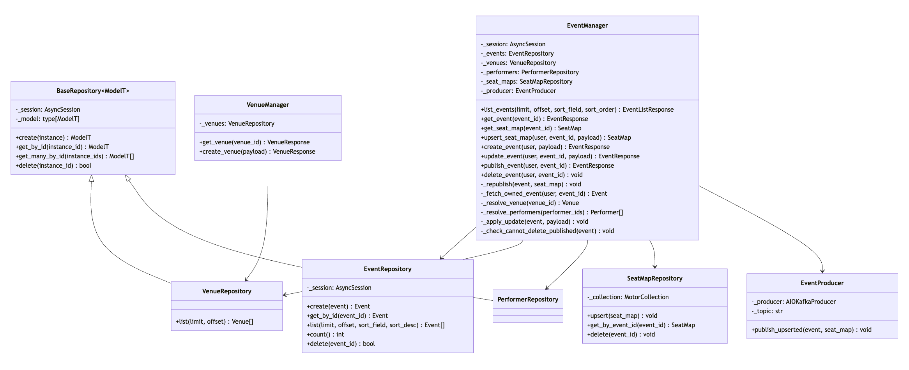
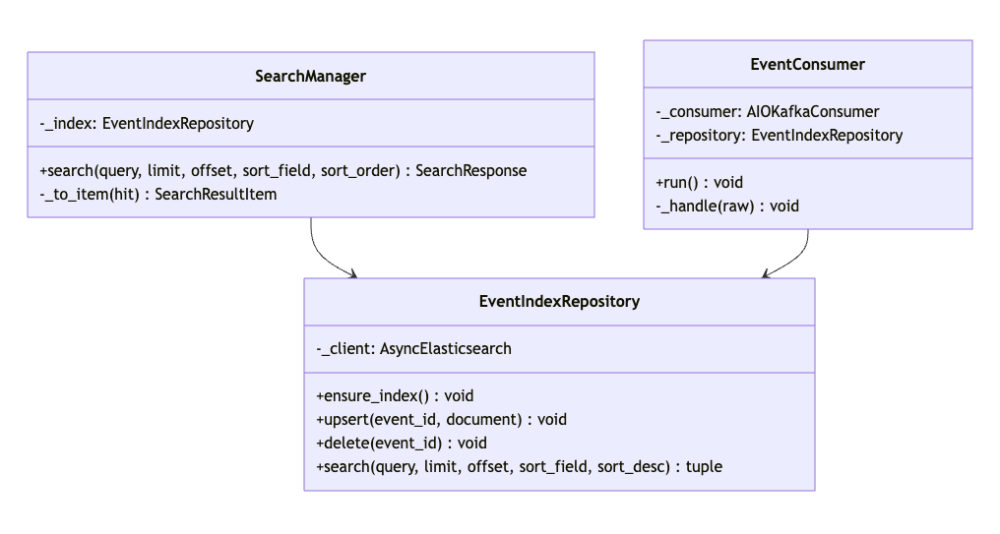
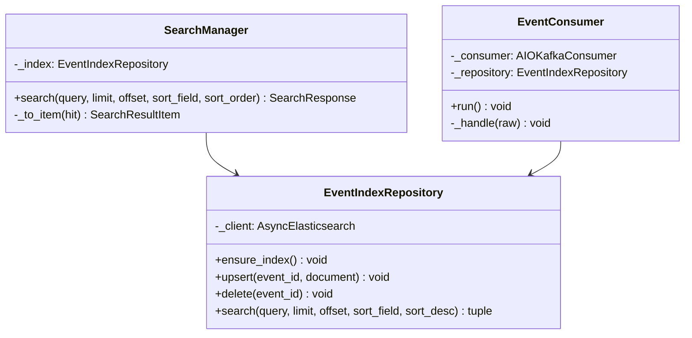
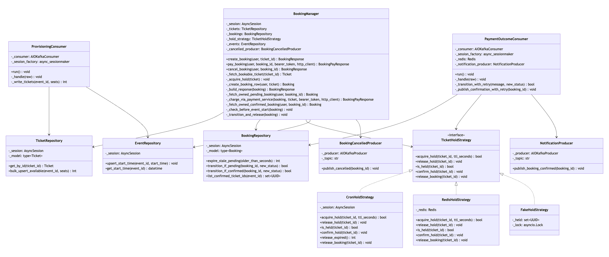
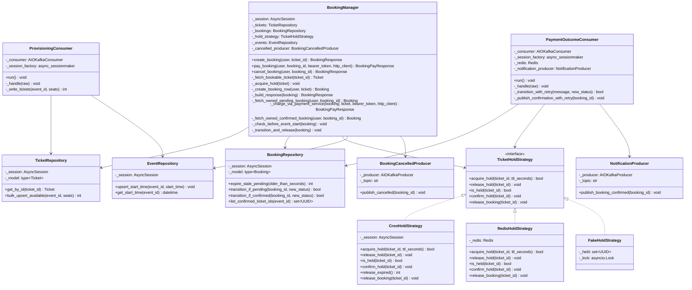
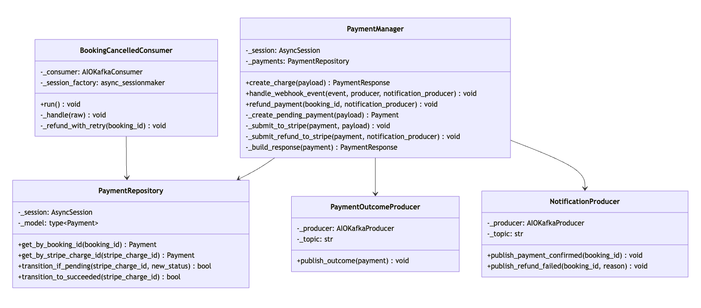
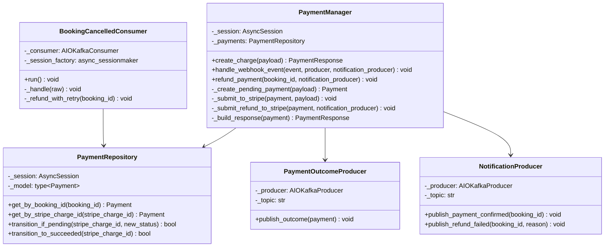
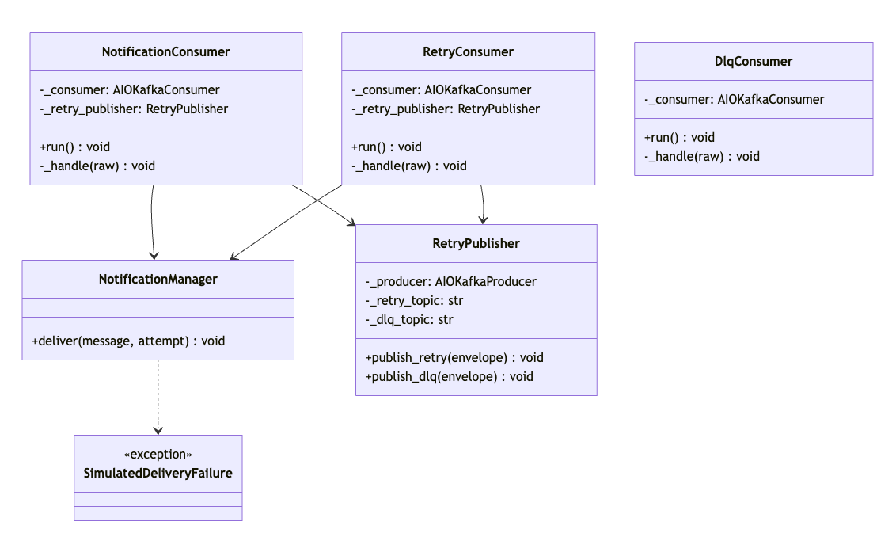
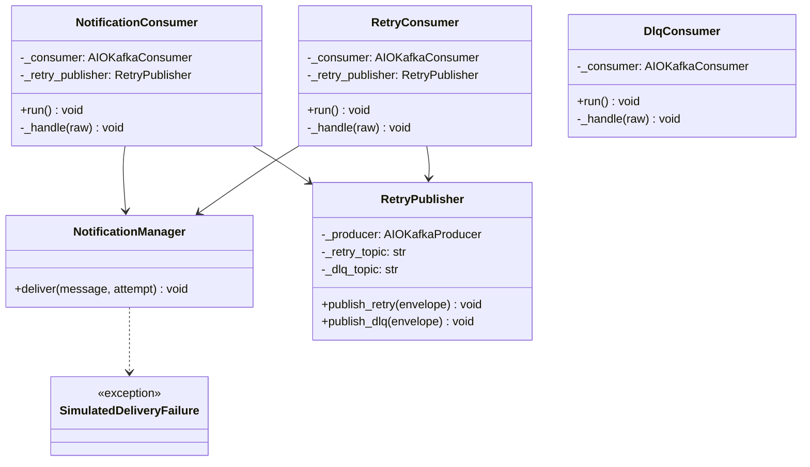

# Class Diagrams

*Status: draft — all five backend services covered (Event Service Phase 1,
Search Service Phase 2, Booking Service Phase 3/4/6/7, Payment Service
Phase 4/6, Notification Service Phase 5). Every diagram below is rendered
to a static PNG (embedded inline) and a vector SVG
(`assets/diagrams/class-*.svg`) from its Mermaid source, ready to insert
directly into the formatted submission. Condensed 2026-08-25 (report trim,
phase 3): each "Why this shape" section was cut to its essential design
rationale, with bug narratives shortened to one or two sentences pointing
at `docs/build-log.md` instead of retold in full — no class, method
signature, fact, number, or verification claim was removed.*

## Event Service — Manager + Repository per feature

*Rendered from the Mermaid source below (`assets/diagrams/class-event-service.svg`
for a vector version).*

## Why this shape

This is the lightweight day-job pattern this project adopted (Internal
per-service layering, `CLAUDE.md`): **Manager + Repository per feature**,
not the full Manager/Logic/DBManager split. `EventManager` folds the
reference pattern's routing and structuring jobs into one class, since
Event Service has no dispatch problem — every use case here is
single-path, unlike Booking Service's dual hold strategy. The
`execute()`-style structuring discipline is kept internally:
`update_event()` and `delete_event()` both read as named, sequenced
private steps (`_fetch_owned_event` → mutate → commit) rather than one
unstructured block, even without a separate class boundary for it.

`EventManager` depends on four repositories and one producer, not one —
it's the one class that talks to both datastores (Postgres via three
repositories, MongoDB via `SeatMapRepository`) and to Kafka (via
`EventProducer`), since seat-map fetches are logically part of the
event-detail use case and publishing is a side effect of the same
mutations the repositories commit. Repositories stay single-datastore,
single-model, business-rule-free by design. `_producer` is typed
`EventProducer | None` — `None` for read-only/plain-`create_event` paths
that never publish, a real instance for every route that does (§7.1).

`VenueRepository`/`PerformerRepository` inherit shared CRUD from a generic
`BaseRepository[ModelT]`, extracted once the duplication showed up in two
places (a Phase 1 review-gate simplification). `EventRepository`
deliberately doesn't inherit it — it always eager-loads
`venue`/`performers` via `selectinload`, model-specific enough that
forcing it through the generic base isn't worth it for one repository.

**Status:** Implemented, Tested — reflects the actual class structure
under `services/event-service/app/logic/` and `app/db/` as of Phase 3
(Phase 1 base + the P1 addendum's `upsert_seat_map`/`create_venue` +
Phase 2's `EventProducer` wiring + Phase 3's
`_check_cannot_delete_published`, replacing the never-implemented
`_check_no_bookings` stub once Booking Service gave it something concrete
to resolve against).

## Search Service — Manager + Repository, adapted for a non-SQL store

*Rendered from the Mermaid source below (`assets/diagrams/class-search-service.svg`
for a vector version).*

## Why this shape

Search Service has no Postgres or MongoDB of its own — Elasticsearch is
explicitly not a source of truth (§8) — so `EventIndexRepository` plays
`EventRepository`'s role (query/write only, no business rules) against a
different kind of store. The Manager + Repository shape doesn't change;
only what's underneath the Repository does.

`EventConsumer` has no Manager above it, deliberately: an ES upsert-or-delete
by ID *is* the whole operation, nothing to sequence above it. Both
`SearchManager` (`GET /search`) and `EventConsumer` (the Kafka integration
point) depend on the same `EventIndexRepository`, so there's exactly one
place that talks to Elasticsearch even though the two entry points never
share a Manager.

**Status:** Implemented, Tested — reflects the actual class structure
under `services/search-service/app/logic/`, `app/db/`, and `app/kafka/` as
of Phase 2.

## Booking Service — Manager + Repository, plus the one Strategy interface in this codebase

*Rendered from the Mermaid source below (`assets/diagrams/class-booking-service.svg`
for a vector version).*

## Why this shape

`BookingManager` follows the same Manager + Repository shape as
`EventManager`/`SearchManager`, plus `TicketHoldStrategy` — the one place
this codebase genuinely needs to branch between alternate execution paths
(§6). The dual hold mechanism (cron sweep vs. Redis TTL) is swappable at
runtime via one `HOLD_STRATEGY` config value, without `BookingManager` or
the Phase 8 benchmark harness ever branching on which is active.
`FakeHoldStrategy` is the in-memory stand-in that lets `BookingManager`'s
unit tests run with neither real strategy's infrastructure present
(P3.T3).

**Hold-state storage is deliberately asymmetric between the two real
implementations, despite an identical interface.** `CronHoldStrategy`'s
hold state *is* `Ticket.status`/`Ticket.hold_expires_at` — `acquire_hold`
is one atomic conditional `UPDATE ... WHERE status = 'available'`, the
same rowcount-checked pattern used to fix `BaseRepository.delete()`'s
TOCTOU race pre-Phase-3. `RedisHoldStrategy`'s hold state lives *only* in
Redis (`SET NX EX`) and never writes `Ticket.status` — the Redis key
self-expires, no sweep needed for that half. `Ticket.status` only
reflects live hold state under cron; anything needing "is this seat held"
must ask the active strategy's `is_held()`. A documented trade-off, not an
oversight.

**The Redis strategy still needs a sweep — for the `Booking` row, not the
lock.** A Phase 3 review found the `PENDING` row created alongside a Redis
hold was never being swept, permanently blocking the seat once a hold was
abandoned (see Appendix A). Fixed with
`BookingRepository.expire_stale_pending()`, an age-based sweep comparing
`created_at` against `hold_ttl_seconds` (since there's no `Ticket`-side
expiry column under this strategy), run on its own APScheduler job —
`hold_sweep.py` now branches on the active `HOLD_STRATEGY` and schedules
whichever sweep applies, rather than only existing for the cron strategy
as originally built.

`ProvisioningConsumer` has no Manager above it (no second entry point to
unify with, per `CLAUDE.md`'s consumer-with-no-API-route exception) and
calls `TicketRepository` directly. Idempotency is structural — one
`INSERT ... ON CONFLICT DO NOTHING` keyed on the seat's unique constraint,
so a redelivered message matches zero rows rather than needing a checked
branch. Both `bulk_upsert_available` and
`CronHoldStrategy.release_expired()` batch through a shared `chunked()`
helper to stay under Postgres's ~32,767-bind-param cap. `_write_tickets`
retries a transient failure in place (bounded, with backoff) before
`_handle` gives up on a message; `enable_auto_commit` is `False` on the
underlying `AIOKafkaConsumer` so a genuine process crash mid-write is
always safely redelivered, independent of whether a caught-and-retried
failure was ultimately given up on or not.

**Status:** Implemented, Tested, Verified (live) — reflects the actual
class structure under `services/booking-service/app/logic/`, `app/db/`,
and `app/kafka/` as of the Phase 3 checkpoint, including fixes from both
review passes (Appendix A). All three `TicketHoldStrategy` implementations
proven against the identical shared contract test suite
(`tests/unit/test_hold_strategy_contract.py` for the fake,
`tests/integration/test_hold_strategy_contract.py` for cron and Redis
against real Postgres/Redis via `testcontainers`); the concurrency
claim (20-25 concurrent clients racing one seat, exactly one wins) proven
under both real strategies in `tests/integration/test_concurrency_suite.py`
*and* live via 20 concurrent `curl` requests through Traefik. Verified
live under both `HOLD_STRATEGY` values: a real 12-seat event provisions
12/12 `Ticket` rows, `POST /bookings` returns a `PENDING` booking with the
seat held, a second attempt on the same seat cleanly 409s under both
strategies. The Redis-sweep fix specifically was reproduced and confirmed
fixed live end-to-end (booked and abandoned a seat, confirmed it stayed
blocked while the hold was live, waited past TTL + sweep interval,
confirmed `hold_sweep_expired_stale_redis_bookings` in the logs, then
confirmed a fresh booking on the same seat succeeded) — not just a
code-reading claim.

**Phase 4 additions**: `BookingManager.pay_booking` and
`TicketHoldStrategy.confirm_hold` close two gaps Phase 3 left open —
"Booking Service fronts payment" (§9 amendment) means the paying client
never talks to Payment Service directly, and `TicketStatus.BOOKED` had
been checked by `_fetch_bookable_ticket` since Phase 3 but never actually
*set* by any code path until this phase gave `confirm_hold` a real
implementation per strategy (`CronHoldStrategy` transitions
`HELD`→`BOOKED`; `RedisHoldStrategy`, which never writes `Ticket.status`
at all, just deletes the now-superseded Redis key).
`PaymentOutcomeConsumer` follows `ProvisioningConsumer`'s exact shape and
reuses `BookingRepository.transition_if_pending` — a conditional `UPDATE
... WHERE status = 'pending'` — making redelivery a structural no-op.
**Status:** Implemented, Tested, Verified (live) — see the Payment Service
section below for the synchronous call this feeds.

**Phase 6 additions**: `BookingManager.cancel_booking` and a genuine third
`TicketHoldStrategy` method, `release_booking` — not a `release_hold`
reuse, since a `CONFIRMED` booking's ticket is `BOOKED`, not `HELD`, and
the two methods target different source states. `CronHoldStrategy` does a
real `UPDATE ... WHERE status = 'BOOKED'`; `RedisHoldStrategy` is a
documented no-op, since re-booking correctness there comes from
`uq_bookings_active_ticket` no longer matching once `Booking.status` flips
to `CANCELLED`, not from any Ticket-table write. `EventRepository` is new
(not a `BaseRepository` subclass — `Event`'s PK is `event_id`) solely so
`cancel_booking` has a `start_time` to enforce the cancellation cutoff
(§22), populated by `ProvisioningConsumer` with no new integration point.
**A missing `Event` row fails the cutoff check closed (409), not open** —
found at CHECKPOINT, since the original silently treated "no start time on
record" as "before the cutoff," for any booking whose event predates this
table (real and reachable — two events in the dev stack; see Appendix A). `BookingCancelledProducer`
is Booking Service's first Kafka producer (integration point #5, §22) —
the same thin `send_and_wait` wrapper shape `PaymentOutcomeProducer`
already established on the Payment Service side. `cancel_booking`
publishes *before* committing, matching the publish-before-commit
convention Phase 4's CHECKPOINT review established. **Status:**
Implemented, Tested, Verified (live).

**Phase 5 additions**: `PaymentOutcomeConsumer` gained a
`NotificationProducer` dependency and `_publish_confirmation_with_retry`,
completing integration point #3's producer side on the Booking Service
end (`booking_confirmed`, alongside Payment Service's own
`payment_confirmed` and `refund_failed` paths). This one deliberately
does **not** publish inside `_transition_with_retry`'s retried
DB-transaction closure the way `cancel_booking`'s publish-before-commit
call does — a code-review finding caught that `_run_with_retry`'s
give-up-and-move-on design would have silently rolled back an
already-successful booking confirmation on a persistently-failing
publish, since no Kafka-consumer-level redelivery exists to retry it (see
Appendix A). Fixed by moving the publish to a separate step, gated on
`transitioned and message.action is SUCCEEDED`, after the DB transition
commits — the transition is the source of truth first, the notification
is a best-effort step afterward (its own small bounded retry) that can't
undo it.

**Status:** Implemented, Tested, Verified (live) — a real `pay` success
produced a real `notification_delivered` log line
(`action=booking_confirmed`, `attempt=1`) in Notification Service's logs.

## Payment Service — Manager + Repository, plus the system's one synchronous inter-service call

*Rendered from the Mermaid source below (`assets/diagrams/class-payment-service.svg`
for a vector version).*

## Why this shape

Same Manager + Repository shape as every other service — `PaymentManager`
has the smallest dependency footprint of the four Managers, since a
`Payment` row's lifecycle is driven by exactly two entry points it owns
directly: the charge-initiation call and the webhook. No consumer class on
this side — Payment Service is a Kafka *producer* for integration point
#4, not a consumer.

**`create_charge` is meant to be called by Booking Service, not a browser
client** (§9 amendment) — the one deliberate exception to
"cross-service data only via Kafka," made because initiating a charge
needs an immediate request/response result. `PaymentManager` itself has no
idea it's being called synchronously by another service — the ownership
check lives entirely in `BookingManager.pay_booking`, on the other side of
that call. Idempotency is a belt-and-suspenders pair: `create_charge`
checks `existing.stripe_charge_id is not None` before short-circuiting (a
`NULL` charge ID means a previous attempt never actually reached Stripe
and must genuinely retry — a real bug caught by live testing, see Appendix
A), and Stripe's own `idempotency_key` (the booking ID) is the backstop.

**`/payments/charge` is reachable only over the internal Docker network,
not through Traefik** — a CHECKPOINT `/pre-pr` review, not initial
self-verification, found the original Traefik rule
(`PathPrefix('/payments')`) routed the whole service publicly, letting any
authenticated user call `/payments/charge` directly with an arbitrary
`booking_id`/`amount_cents` and bypass the ownership check
`BookingManager.pay_booking` exists to enforce. Fixed by narrowing the
Traefik rule to `PathPrefix('/payments/webhook')` only
(`infra/docker-compose.yml`), live-verified both directions post-fix; the
most severe of six issues that CHECKPOINT pass caught (see Appendix A).

**Webhook-driven confirmation is the sole source of truth for a Payment's
terminal status** (§9) — `create_charge`'s synchronous Stripe response is
never trusted for that, even though Stripe test mode often resolves a
`PaymentIntent` synchronously, because a lost synchronous response after
Stripe already processed the charge would otherwise be indistinguishable
from a genuine failure. `handle_webhook_event` is idempotent the same way
every Kafka consumer in this system is (§7, applied to a webhook instead
of a Kafka redelivery): a rowcount-gated conditional `UPDATE`
(`PaymentRepository.transition_if_pending`, mirroring `BookingRepository`'s
method of the same name) only transitions a still-`pending` row, proven
by a concurrency test racing two independent sessions against the same
delivery. The original used a read-then-write check and
committed the terminal status *before* publishing to Kafka (found at the
same CHECKPOINT review) — meaning a publish failure could strand a
Payment permanently, since Stripe's own retry would hit the
already-terminal guard and silently no-op, losing the outcome for good.
Fixed by reordering to publish before commit, so a publish failure
propagates uncommitted and Stripe's retry genuinely gets another attempt.

**Status:** Implemented, Tested, Verified (live, except the final
real-Stripe leg — see Technologies Used) — reflects the actual class
structure under `services/payment-service/app/logic/`, `app/db/`, and
`app/kafka/` as of Phase 4. Live-verified against the real running stack:
a real venue/event/seat-map created and published through the organizer
API carried `price_cents` through Kafka into a real `Ticket` row; `/pay`'s
404/409 paths (a non-owner's request 404s, existence hidden, not 403) and
the full synchronous call chain into Payment Service's own auth check and
a genuine HTTPS call to Stripe all verified live (failing only at
Stripe's own `401 Invalid API Key`, since no real Stripe test-mode
credentials were available this session — a real, tracked gap, not
silently marked done); integration point #4 (`payment.outcomes`) verified
live end-to-end for both outcomes by producing directly to the topic
(bypassing Stripe, since the mechanism under test is the Kafka consumer,
not Stripe's delivery): `succeeded` → `Booking` `CONFIRMED` + `Ticket`
`BOOKED`; `failed` → `Booking` `EXPIRED` + `Ticket` `AVAILABLE`
immediately (not waiting for `HOLD_TTL_SECONDS`); redelivering the same
`failed` message produced no second log line and no second effect. `POST
/payments/webhook` with an invalid signature verified live to reject with
400 before touching any `Payment` row.

**Phase 6 additions**: `PaymentManager.refund_payment` and Payment
Service's first Kafka consumer, `BookingCancelledConsumer` (integration
point #5, §22) — no API route, the `booking.cancelled` message itself is
the authorization. `refund_payment`'s idempotency gate mirrors
`create_charge`'s "resubmit only if the provider-side ID column is still
`NULL`" pattern, since this consumer processes one partition strictly
sequentially so only crash-then-restart redelivery is reachable, and a
retried Stripe call with the same `{booking_id}-refund` idempotency key
(the same pattern as §9, applied to refunds) is already safe by
construction. On a `stripe.error.StripeError`, `refund_payment` does not
roll anything back —
`Payment.status` stays `SUCCEEDED`, the explicit no-re-lock boundary in
§22 — and publishes to a new `NotificationProducer`, the producer side
only of integration point #3 (Notification Service itself doesn't exist
until Phase 5, which runs after this phase in the locked build order;
Kafka producer and consumer are independently deployable, the same
trade-off already accepted for integration point #2's eventual
consistency). **Status:** Implemented, Tested, Verified (live, except a
real Stripe refund succeeding) — a real cancel through `POST
/bookings/{id}/cancel` produced a real `booking.cancelled` message,
consumed by `BookingCancelledConsumer`, reaching a genuine `POST
https://api.stripe.com/v1/refunds` call (failing only at the same
placeholder-key boundary as Phase 4's charge flow, not a bypass),
correctly triggering the refund-failure branch and publishing to
`notifications` (verified directly with a throwaway
`kafka-console-consumer`, message shape correct). Redelivery correctly
*retried* the refund rather than silently no-op'ing, since the first
attempt's refund never actually succeeded (`stripe_refund_id` stayed
`NULL`) — exactly the resubmission-gate semantics documented above; the
true already-refunded-redelivery no-op case is proven in the automated
integration suite
(`test_refund_payment_replay_against_real_db_does_not_double_refund`),
which mocks a successful Stripe response to reach that state.

**Phase 5 addition**: `handle_webhook_event` gained a `notification_producer`
parameter, calling `publish_payment_confirmed` at the same
publish-before-commit position as the existing outcome publish, on the
`SUCCEEDED` branch. **Status:** Implemented, Tested, Verified (live) — a
real webhook delivery produced a real `notification_delivered` log line
(`action=payment_confirmed`).

## Notification Service — Manager only, no Repository, no database (Phase 5)

*Rendered from the Mermaid source below (`assets/diagrams/class-notification-service.svg`
for a vector version).*

## Why this shape

The one deliberate departure from the Manager + Repository template every
other service follows: no Repository layer, no `db/` folder, because
Notification Service has no database of any kind (§17 amendment) —
`NotificationManager.deliver` *is* the delivery (a structured log line,
§19). Three consumer classes exist because they read from three topics
with three different failure-handling shapes, sharing one
`_consume_with_manual_commit` helper and one `_publish_with_retry` helper.

**The retry/DLQ ladder is this phase's design centerpiece.** With no
database, retry state lives on the Kafka message itself —
`RetryEnvelope { attempt, original, last_error }`, round-tripped through
`notifications` → `notification-retry` → `notification-dlq`.
`NotificationConsumer` attempts delivery once; on failure it publishes to
`notification-retry`. `RetryConsumer` sleeps `compute_backoff_seconds(attempt)`
(`min(base ** attempt, cap)`), retries, and either republishes with
`attempt + 1` or routes to the DLQ once attempts are exhausted.
`DlqConsumer` is visibility-only — nothing reprocesses out of it.

**Idempotent by construction, not by an explicit guard** — with no
database row to conditionally update, a duplicate delivery is just a
duplicate log line, tested directly
(`test_redelivery_of_same_message_is_a_safe_no_op`).

**With no real external delivery dependency capable of a genuine
failure** (§19 — log output only), the retry ladder is proven with a
deliberate, honestly-documented instrument:
`Settings.simulated_failure_attempts`, mirroring the same precedent the
Hold-Mechanism Benchmark set for its simulated release trigger (§17). Set
to `0` in the baseline compose file, overridden only for a demo/test.

**A two-round CHECKPOINT review found and fixed four real bugs**, none
caught by self-verification: (1) `compute_backoff_seconds` computed
`base ** attempt` before `min()` capped it, so a sufficiently large
`attempt` raised `OverflowError` instead of being clamped — fixed with a
try/except, and `RetryEnvelope.attempt` was also given a DTO-level bound
(`Field(ge=1, le=1000)`); (2) the three consumers' republish calls to
`notification-retry`/`notification-dlq` were unguarded, unlike every
other Kafka consumer with a side effect in this system, so a single
transient broker error would have permanently killed a consumer task —
fixed with a `_publish_with_retry` helper; (3) the `PaymentOutcomeConsumer`
publish-before-commit ordering bug described above; (4) a second-order bug
the *first* round of fixes introduced — `RetryEnvelope.last_error`'s new
non-blank-string DTO constraint could itself raise `ValidationError` when
constructed from an exception whose `str()` is empty (`str(KeyError())` is
`''`), escaping every guard just added and killing the consumer anyway —
fixed with a small `_error_text(exc)` helper (`str(exc) or repr(exc)`) at
all three internal construction sites. All four fixed and live
re-verified against the real running stack; see `docs/build-log.md`'s
2026-08-18 CHECKPOINT entries for the full list, including two findings
deliberately left unfixed as pre-existing and out of this phase's scope.

**Status:** Implemented, Tested, Verified (live) — reflects the actual
class structure under `services/notification-service/app/logic/` and
`app/kafka/` as of Phase 5. Live-verified against the real running stack,
both directions: a genuine booking→payment→confirmation flow producing
real `notification_delivered` log lines for both `payment_confirmed` and
`booking_confirmed`; and, using an isolated one-off container with
`SIMULATED_FAILURE_ATTEMPTS=1` so the always-on baseline container stayed
untouched, a real `notification_delivery_failed` →
`notification_delivered_after_retry` recovery sequence with real backoff
timing. 11/11 tests green (5 unit, 6 `testcontainers` integration against
a real Kafka broker).

## Booking Service additions (Phase 7)

`TicketRepository` gains `list_by_event(event_id)` (a plain filtered
`SELECT`), and `api/bookings.py` gains `GET
/bookings/events/{event_id}/tickets`, calling
`BookingManager.list_tickets_for_event(event_id)`, which maps each row to
a new `TicketStatusResponse` DTO — the same Manager+Repository shape every
other route uses, not the `search-service` Repository-direct exception
(that exception applies only to a Kafka consumer with no equivalent API
route; this is a real route, so it got its own Manager method, corrected
during this phase's review — see the amendment correction in
decisions-log §23). This is the read half of the seat-map composition
(§23), which had a design but no route until this phase — see Appendix A
for how a real concurrent-booking bug was found through this exact code
path (in `_create_booking_row`, not the new route itself, but exercised
by the same phase's live testing).

**Status:** Implemented, Tested, Verified (live) — `list_by_event` covered
by two new integration tests (real Postgres) and the DTO mapping by two
new unit tests; the route live-verified against the real running stack,
returning correct per-seat status including a real hold flipping a seat
from `available` to `held` between two polls.
