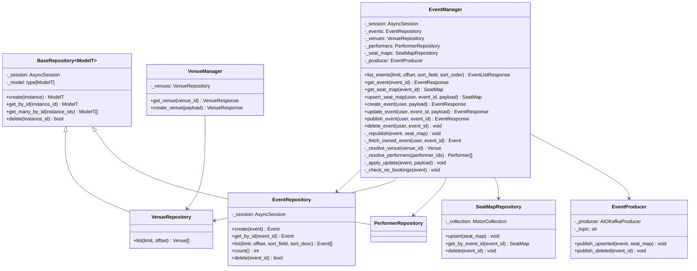
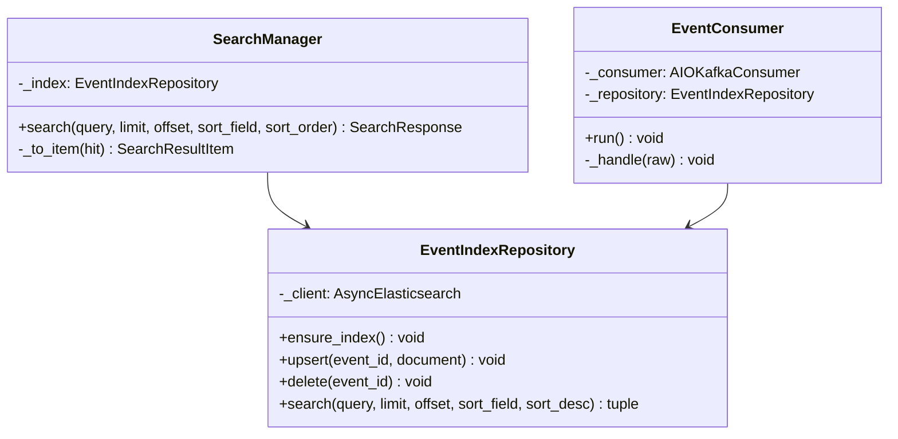

# Class Diagrams

*Status: draft, Event Service (Phase 1) and Search Service (Phase 2)
evidence so far. Booking Service's diagram (Phase 3) will additionally show
the `TicketHoldStrategy` interface — the one place this codebase genuinely
branches between alternate execution paths (see the Internal per-service
layering decision in `CLAUDE.md`); neither service below has an equivalent,
every feature in each is single-path.*

## Event Service — Manager + Repository per feature

## Why this shape

This is the lightweight day-job pattern this project deliberately adopted
(Internal per-service layering, `CLAUDE.md`): **Manager + Repository per
feature**, not the full Manager/Logic/DBManager split. `EventManager` folds
the reference pattern's "which Logic class handles this call" routing job
and the "the actual business rules live here" structuring job into one
class, because Event Service has no dispatch problem — every use case here
is single-path, unlike Booking Service's dual hold strategy. The
structuring discipline the reference `execute()` method enforced is kept
internally: `update_event()` and `delete_event()` both read as named,
sequenced private steps (`_fetch_owned_event` → mutate → commit) rather
than one unstructured block, even without a separate class boundary for
it.

`EventManager` depends on four repositories and one producer, not one
repository — it is the one Event Service class that talks to both
datastores (Postgres via three repositories, MongoDB via
`SeatMapRepository`) and to Kafka (via `EventProducer`), because seat-map
fetches are logically part of the event-detail use case even though the
data lives in a different database, and publishing is a side effect of
the same mutations the repositories already commit. Repositories stay
single-datastore, single-model, and business-rule-free by design —
`EventRepository` doesn't know what "ownership" means, `EventManager` does.
`_producer` is typed `EventProducer | None` — `None` for the read-only and
plain-`create_event` paths that never publish, a real instance injected
into every route that does (§7.1).

`VenueRepository` and `PerformerRepository` inherit shared create/
get_by_id/get_many_by_id/delete boilerplate from a generic
`BaseRepository[ModelT]` — both models needed identical CRUD with nothing
model-specific beyond their SQLAlchemy type, so the duplication was
extracted once it showed up in two places (a Phase 1 review-gate
simplification, not part of the original per-feature design).
`EventRepository` deliberately does **not** inherit it: it always
eager-loads `venue`/`performers` via `selectinload` on every fetch, which
is model-specific enough that forcing it through the generic base would
either weaken the base or special-case it — not worth it for one
repository.

**Status:** Implemented, Tested — reflects the actual class structure under
`services/event-service/app/logic/` and `app/db/` as of the pre-Phase-3
checkpoint (Phase 1 base + the P1 addendum's `upsert_seat_map`/
`create_venue` + Phase 2's `EventProducer` wiring), not a target design.

## Search Service — Manager + Repository, adapted for a non-SQL store

## Why this shape

Search Service has no Postgres or MongoDB of its own — Elasticsearch is
explicitly not a source of truth (§8) — so `EventIndexRepository` plays the
same role `EventRepository` plays in Event Service (query/write methods
only, no business rules) against a different kind of store: an ES index
instead of a SQL table. The Manager + Repository shape doesn't change; only
what's underneath the Repository does. This is the same pattern extension
`CLAUDE.md`'s Conventions section now documents explicitly, so the next
service without its own database (Notification Service, per decisions-log
§4) doesn't have to rediscover it.

`EventConsumer` has no Manager above it — deliberately. Per the per-service
layering decision, a Manager exists to give a multi-step use case a
structured, named-step shape; an ES upsert-or-delete by ID *is* the whole
operation, with nothing to sequence above it. Both `SearchManager` (serving `GET /search`) and `EventConsumer` (serving
the Kafka integration point) depend on the same `EventIndexRepository`, so
there is exactly one place that knows how to talk to Elasticsearch, even
though the two entry points (HTTP route, Kafka message) never share a
Manager — matching the "handlers construct the same `{Feature}Manager` the
API routes use" convention's spirit of one business-logic path per
datastore, just without a Manager in the middle on the consumer side.

**Status:** Implemented, Tested — reflects the actual class structure
under `services/search-service/app/logic/`, `app/db/`, and `app/kafka/` as
of Phase 2.
