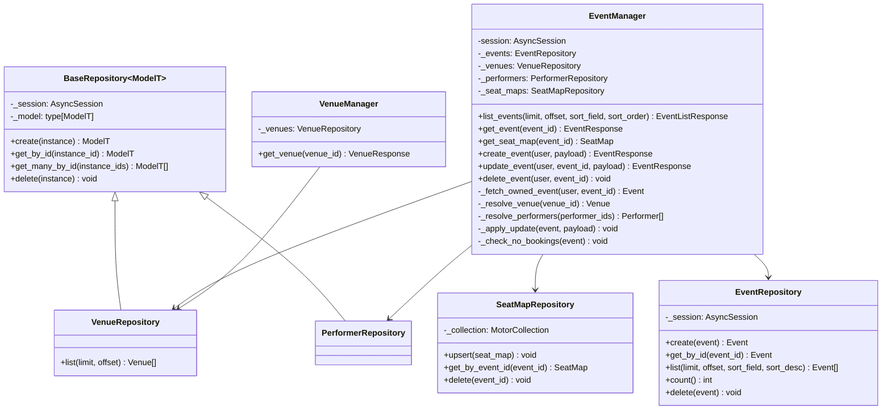

# Class Diagrams

*Status: draft, Event Service only — Phase 1 evidence. Booking Service's
diagram (Phase 3) will additionally show the `TicketHoldStrategy` interface
— the one place this codebase genuinely branches between alternate
execution paths (see the Internal per-service layering decision in
`CLAUDE.md`); Event Service has no equivalent, every feature here is
single-path.*

## Event Service — Manager + Repository per feature

## Why this shape

This is the lightweight day-job pattern this project deliberately adopted
(Internal per-service layering, `CLAUDE.md`): **Manager + Repository per
feature**, not the full Manager/Logic/DBManager split. `EventManager` folds
the reference pattern's "which Logic class handles this call" routing job
and the "the actual business rules live here" structuring job into one
class, because Event Service has no dispatch problem — every use case here
is single-path, unlike Booking Service's dual hold strategy. The
structuring discipline the reference `execute()` method enforced is kept
internally: `update_event()` and `delete_event()` both read as named,
sequenced private steps (`_fetch_owned_event` → mutate → commit) rather
than one unstructured block, even without a separate class boundary for
it.

`EventManager` depends on four repositories, not one — it is the one
Event Service class that talks to both datastores (Postgres via three
repositories, MongoDB via `SeatMapRepository`), because seat-map fetches
are logically part of the event-detail use case even though the data
lives in a different database. Repositories stay single-datastore,
single-model, and business-rule-free by design — `EventRepository` doesn't
know what "ownership" means, `EventManager` does.

`VenueRepository` and `PerformerRepository` inherit shared create/
get_by_id/get_many_by_id/delete boilerplate from a generic
`BaseRepository[ModelT]` — both models needed identical CRUD with nothing
model-specific beyond their SQLAlchemy type, so the duplication was
extracted once it showed up in two places (a Phase 1 review-gate
simplification, not part of the original per-feature design).
`EventRepository` deliberately does **not** inherit it: it always
eager-loads `venue`/`performers` via `selectinload` on every fetch, which
is model-specific enough that forcing it through the generic base would
either weaken the base or special-case it — not worth it for one
repository.

**Status:** Implemented, Tested — reflects the actual class structure
under `services/event-service/app/logic/` and `app/db/` as of Phase 1, not
a target design.
