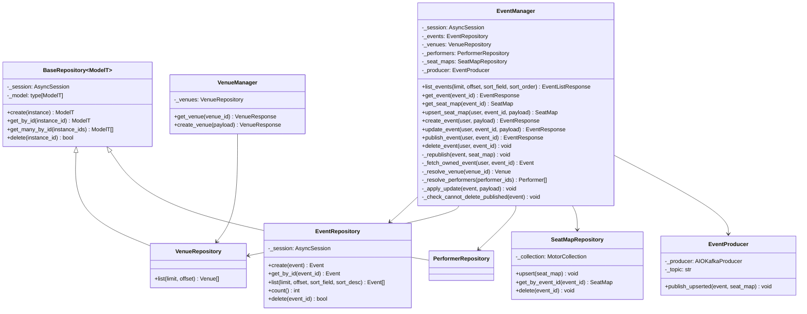
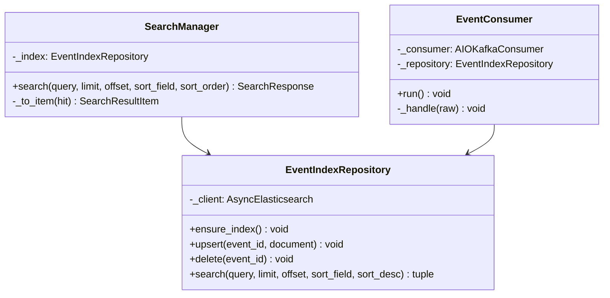
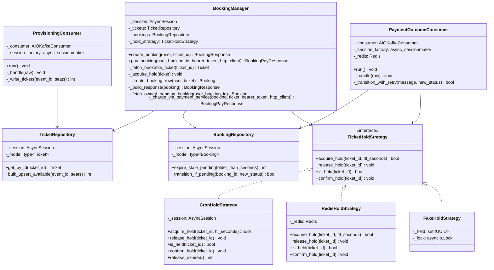
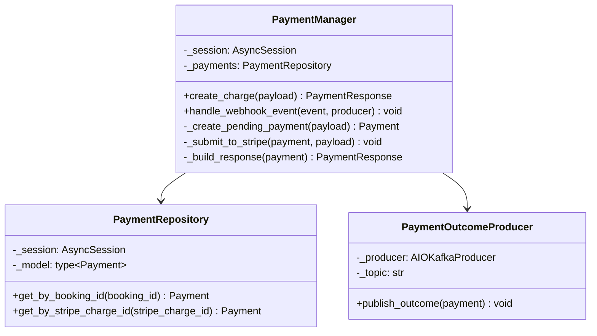

# Class Diagrams

*Status: draft, Event Service (Phase 1), Search Service (Phase 2), Booking
Service (Phase 3), and Payment Service (Phase 4) evidence so far.*

## Event Service — Manager + Repository per feature

## Why this shape

This is the lightweight day-job pattern this project deliberately adopted
(Internal per-service layering, `CLAUDE.md`): **Manager + Repository per
feature**, not the full Manager/Logic/DBManager split. `EventManager` folds
the reference pattern's "which Logic class handles this call" routing job
and the "the actual business rules live here" structuring job into one
class, because Event Service has no dispatch problem — every use case here
is single-path, unlike Booking Service's dual hold strategy. The
structuring discipline the reference `execute()` method enforced is kept
internally: `update_event()` and `delete_event()` both read as named,
sequenced private steps (`_fetch_owned_event` → mutate → commit) rather
than one unstructured block, even without a separate class boundary for
it.

`EventManager` depends on four repositories and one producer, not one
repository — it is the one Event Service class that talks to both
datastores (Postgres via three repositories, MongoDB via
`SeatMapRepository`) and to Kafka (via `EventProducer`), because seat-map
fetches are logically part of the event-detail use case even though the
data lives in a different database, and publishing is a side effect of
the same mutations the repositories already commit. Repositories stay
single-datastore, single-model, and business-rule-free by design —
`EventRepository` doesn't know what "ownership" means, `EventManager` does.
`_producer` is typed `EventProducer | None` — `None` for the read-only and
plain-`create_event` paths that never publish, a real instance injected
into every route that does (§7.1).

`VenueRepository` and `PerformerRepository` inherit shared create/
get_by_id/get_many_by_id/delete boilerplate from a generic
`BaseRepository[ModelT]` — both models needed identical CRUD with nothing
model-specific beyond their SQLAlchemy type, so the duplication was
extracted once it showed up in two places (a Phase 1 review-gate
simplification, not part of the original per-feature design).
`EventRepository` deliberately does **not** inherit it: it always
eager-loads `venue`/`performers` via `selectinload` on every fetch, which
is model-specific enough that forcing it through the generic base would
either weaken the base or special-case it — not worth it for one
repository.

**Status:** Implemented, Tested — reflects the actual class structure under
`services/event-service/app/logic/` and `app/db/` as of Phase 3 (Phase 1
base + the P1 addendum's `upsert_seat_map`/`create_venue` + Phase 2's
`EventProducer` wiring + Phase 3's `_check_cannot_delete_published`, which
replaced the never-implemented `_check_no_bookings` stub once Booking
Service existed and gave the stub something concrete to resolve against),
not a target design.

## Search Service — Manager + Repository, adapted for a non-SQL store

## Why this shape

Search Service has no Postgres or MongoDB of its own — Elasticsearch is
explicitly not a source of truth (§8) — so `EventIndexRepository` plays the
same role `EventRepository` plays in Event Service (query/write methods
only, no business rules) against a different kind of store: an ES index
instead of a SQL table. The Manager + Repository shape doesn't change; only
what's underneath the Repository does. This is the same pattern extension
`CLAUDE.md`'s Conventions section now documents explicitly, so the next
service without its own database (Notification Service, per decisions-log
§4) doesn't have to rediscover it.

`EventConsumer` has no Manager above it — deliberately. Per the per-service
layering decision, a Manager exists to give a multi-step use case a
structured, named-step shape; an ES upsert-or-delete by ID *is* the whole
operation, with nothing to sequence above it. Both `SearchManager` (serving `GET /search`) and `EventConsumer` (serving
the Kafka integration point) depend on the same `EventIndexRepository`, so
there is exactly one place that knows how to talk to Elasticsearch, even
though the two entry points (HTTP route, Kafka message) never share a
Manager — matching the "handlers construct the same `{Feature}Manager` the
API routes use" convention's spirit of one business-logic path per
datastore, just without a Manager in the middle on the consumer side.

**Status:** Implemented, Tested — reflects the actual class structure
under `services/search-service/app/logic/`, `app/db/`, and `app/kafka/` as
of Phase 2.

## Booking Service — Manager + Repository, plus the one Strategy interface in this codebase

## Why this shape

`BookingManager` follows the exact same Manager + Repository shape as
`EventManager`/`SearchManager` — with one addition: `TicketHoldStrategy`,
the strategy-pattern interface `CLAUDE.md`'s Internal per-service layering
decision already anticipated as the one place this codebase genuinely
needs to branch between alternate execution paths (§6). Every other
feature in every service is single-path, which is exactly why none of
them needed a second dispatch mechanism; the dual hold mechanism is the
one place a real architectural choice (cron sweep vs. Redis TTL) has to
be swappable at runtime, via one `HOLD_STRATEGY` config value, without
`BookingManager` or the Phase 8 benchmark harness ever branching on which
is active. `FakeHoldStrategy` is the third implementation — not a
production path, but the in-memory stand-in that lets `BookingManager`'s
own unit tests run with neither real strategy's infrastructure present,
per P3.T3's explicit "trivial fake/no-op implementation" requirement.

**Hold-state storage is deliberately asymmetric between the two real
implementations, despite satisfying an identical interface** — this is
the one design decision in this diagram that isn't visible from the
method signatures alone, so it's worth stating here rather than only in
code comments. `CronHoldStrategy`'s hold state *is* `Ticket.status` /
`Ticket.hold_expires_at` in Postgres: `acquire_hold` is a single atomic
conditional `UPDATE ... WHERE status = 'available'`, the same
rowcount-checked-under-concurrency pattern already used to fix
`BaseRepository.delete()`'s TOCTOU race in the pre-Phase-3 hardening pass
— two concurrent transactions serialize on Postgres's row lock, and the
loser's `WHERE` clause re-evaluates false once the winner has committed.
`RedisHoldStrategy`'s hold state lives *only* in Redis (`SET NX EX`) and
deliberately never writes `Ticket.status` at all — the Redis *key* releases
itself via its own TTL expiry, with no sweep needed for that half of the
picture. `Ticket.status` only reflects live hold state under the cron
strategy; anything needing to know "is this seat currently held" must ask
the active strategy's `is_held()`, never read `Ticket.status` directly. This
is a documented trade-off, not an oversight — the same reasoning the project
already applied to the async-provisioning eventual-consistency window (§7,
§26): state the trade-off plainly rather than hide it.

**The Redis strategy still needs a sweep — just for a different row than the
cron strategy's.** `BookingManager` creates a `Booking` row (status
`PENDING`) the moment a hold is acquired, under either strategy (§21) — and
Redis's key expiry knows nothing about that Postgres row. Found during this
phase's dedicated review: an abandoned hold under `HOLD_STRATEGY=redis`
correctly freed the Redis key, but left the `PENDING` Booking row in place
forever, and `uq_bookings_active_ticket` (a partial unique index treating
`PENDING`/`CONFIRMED` as "active") then permanently blocked any future
booking on that seat — the two strategies were not actually behaviorally
equivalent, which would have quietly undercut the Phase 8 benchmark
comparison. Fixed with `BookingRepository.expire_stale_pending()`, an
age-based sweep (`created_at` vs. `hold_ttl_seconds`, since there's no
`Ticket`-side expiry column to key off of under this strategy) run on its
own APScheduler job — `hold_sweep.py` now branches on the active
`HOLD_STRATEGY` and schedules whichever sweep applies, rather than only
existing for the cron strategy as originally built.

`ProvisioningConsumer` has no Manager above it, for the same reason
`EventConsumer` (Search Service) doesn't: nothing else writes `Ticket`
rows from a Kafka payload, so there is no second entry point to unify a
Manager's dispatch job with (per `CLAUDE.md`'s consumer-with-no-API-route
exception). It calls `TicketRepository` directly. Idempotency is
structural, not a checked condition: `bulk_upsert_available` is one
`INSERT ... ON CONFLICT DO NOTHING` statement per message keyed against
the `(event_id, section, row_name, seat_label)` unique constraint, so a
redelivered message matches zero rows on its second attempt rather than
needing an explicit "have I seen this before" branch. `bulk_upsert_available`
and `CronHoldStrategy.release_expired()` both batch their SQL through a
shared `chunked()` helper (`app/db/chunking.py`) rather than each
reimplementing the same bind-param-limit chunking loop — a large seat map or
a large backlog of expired holds would otherwise overflow Postgres's
~32,767-bind-param cap in a single statement. `_write_tickets`, the private
method that owns the actual DB write, retries a transient failure in place
(bounded, with backoff) before `_handle` gives up on a message and the
consumer commits past it — `enable_auto_commit` is deliberately `False` on
the underlying `AIOKafkaConsumer` so a genuine process crash mid-write is
always safely redelivered, independent of whether a caught-and-retried
failure was ultimately given up on or not.

**Status:** Implemented, Tested, Verified (live) — reflects the actual
class structure under `services/booking-service/app/logic/`, `app/db/`,
and `app/kafka/` as of the Phase 3 checkpoint, including the fixes from
both this phase's review passes (see the Testing Strategy chapter's "two
review passes" section for the full list). All three `TicketHoldStrategy`
implementations proven against the identical shared contract test suite
(`tests/unit/test_hold_strategy_contract.py` for the fake,
`tests/integration/test_hold_strategy_contract.py` for cron and Redis
against real Postgres/Redis via `testcontainers`); the concurrency claim
itself (20-25 concurrent clients racing one seat, exactly one wins) proven
under both real strategies in `tests/integration/test_concurrency_suite.py`
*and* live against the running stack via 20 concurrent `curl` requests
through Traefik. Verified live against the running stack, both
`HOLD_STRATEGY` values in turn: publishing a real event through Event
Service provisions real `Ticket` rows (12/12 seats), `POST /bookings`
returns a `PENDING` booking with the seat held, and a second booking
attempt on the same seat cleanly returns 409 under both strategies. The
Redis-sweep fix specifically was verified live end-to-end: booked and
abandoned a seat under `HOLD_STRATEGY=redis` with a short TTL, confirmed
the seat stayed blocked while the Redis hold was live, waited past TTL +
sweep interval, confirmed `hold_sweep_expired_stale_redis_bookings` in the
logs, then confirmed a fresh booking on the same seat succeeded — the
class-diagram claim above about the Redis sweep is not just a code-reading
claim, it's a reproduced-and-confirmed-fixed one.

**Phase 4 additions**: `BookingManager.pay_booking` and `TicketHoldStrategy
.confirm_hold` close two gaps the Phase 3 diagram above left open —
"Booking Service fronts payment" (decisions-log §9 amendment) means the
paying client never talks to Payment Service directly, and
`TicketStatus.BOOKED` had been checked by `_fetch_bookable_ticket` since
Phase 3 but never actually *set* by any code path until this phase gave
`confirm_hold` a real implementation per strategy (`CronHoldStrategy`
transitions `HELD`→`BOOKED`; `RedisHoldStrategy`, which never writes
`Ticket.status` at all, just deletes the now-superseded Redis key).
`PaymentOutcomeConsumer` follows `ProvisioningConsumer`'s exact shape
(direct-repository access, no Manager above it, since nothing else drives
this transition; `enable_auto_commit=False` plus a bounded DB-write retry)
and reuses `BookingRepository.transition_if_pending` — a single
conditional `UPDATE ... WHERE status = 'pending'` — to make redelivery a
structural no-op the same way `bulk_upsert_available`'s `ON CONFLICT DO
NOTHING` does for provisioning, rather than a checked "have I seen this
before" branch. **Status:** Implemented, Tested, Verified (live) — see the
Payment Service section below for the synchronous call this feeds and the
live verification both `confirm_hold`/`transition_if_pending` branches
received.

## Payment Service — Manager + Repository, plus the system's one synchronous inter-service call

## Why this shape

Same Manager + Repository shape as every other service — `PaymentManager`
has exactly one repository and one producer dependency, the smallest of the
four services' Managers, because a `Payment` row's whole lifecycle
(`pending` → `succeeded`/`failed`) is driven by exactly two entry points it
owns directly: the charge-initiation call and the webhook. No consumer
class exists on this side — Payment Service is a Kafka *producer* for
integration point #4, not a consumer of anything.

**`create_charge` is meant to be called by Booking Service, not by a
browser client** (decisions-log §9 amendment) — the one deliberate, narrow
exception to "cross-service data only via Kafka" in this system, made
because initiating a charge needs an immediate request/response result
(did Stripe accept the attempt right now), which is a different shape of
problem than the eventually-consistent facts the five Kafka integration
points (§7) carry everywhere else. `PaymentManager` itself has no idea
it's being called synchronously by another service rather than a route
handler acting on a browser request — the ownership check that makes this
safe lives entirely in `BookingManager.pay_booking`, on the other side of
that call, where `booking_db` actually is (§8). Idempotency here is a
defense-in-depth belt-and-suspenders pair: `create_charge` checks
`existing.stripe_charge_id is not None` before short-circuiting (a Payment
row with no `stripe_charge_id` yet means a previous attempt never actually
reached Stripe and must genuinely retry — a real bug caught by live testing
this phase, not a hypothetical, see `build-log.md`'s 2026-08-17 entry), and
Stripe's own `idempotency_key` (the booking ID) is the backstop if two
requests somehow race past that check simultaneously.

**A genuine authorization bypass in that design was found at CHECKPOINT,
not by self-verification** — the routine `/pre-pr` code-review pass, not
the initial self-verification, is what caught it. "`PaymentManager` trusts
the caller already did the ownership check" is only actually true if
`/payments/charge` is *unreachable* except from Booking Service — and it
wasn't: Traefik's original `PathPrefix('/payments')` rule routed the whole
service publicly, so any authenticated end user could `POST
/payments/charge` directly with an arbitrary `booking_id` and
`amount_cents`, bypassing both checks `BookingManager.pay_booking` exists
to enforce. Fixed by narrowing the Traefik rule to
`PathPrefix('/payments/webhook')` only (`infra/docker-compose.yml`) —
`/payments/charge` is now reachable exclusively over the internal Docker
network, which is how Booking Service already called it. Live-verified
post-fix both directions: `POST localhost/payments/charge` through Traefik
now 404s; the internal call from `booking-service` still succeeds. See
`build-log.md`'s 2026-08-17 CHECKPOINT entry for the full list — this was
the most severe of six findings that session, all fixed before this
checkpoint closed.

**Webhook-driven confirmation is the sole source of truth for a Payment's
terminal status** (§9) — `create_charge`'s synchronous Stripe response is
never trusted for that, even though Stripe test mode often resolves a
`PaymentIntent` synchronously, because a lost synchronous response after
Stripe already processed the charge would otherwise be indistinguishable
from a genuine failure. `handle_webhook_event` is idempotent the same way
Booking Service's Kafka consumers are (§7's general rule, applied to a
webhook instead of a Kafka redelivery): a rowcount-gated conditional
`UPDATE` (`PaymentRepository.transition_if_pending`, mirroring
`BookingRepository`'s method of the same name) only transitions a `Payment`
still `pending`, so a replayed webhook — or two genuinely overlapping
deliveries racing each other — can't both win it, proven by a concurrency
integration test opening two independent sessions and racing the same
delivery. The original version used a read-then-write check instead
(found in the same CHECKPOINT review) and also committed the terminal
status *before* publishing to Kafka, which meant a publish failure could
strand a Payment permanently — Stripe's own retry would hit the
already-terminal guard and silently no-op, losing the outcome for good.
Fixed by reordering to publish before commit, so a publish failure
propagates uncommitted and Stripe's retry genuinely gets another attempt.

**Status:** Implemented, Tested, Verified (live, except the final real-Stripe
leg — see below) — reflects the actual class structure under
`services/payment-service/app/logic/`, `app/db/`, and `app/kafka/` as of
Phase 4. Live-verified against the real running stack: a real
venue/event/seat-map created and published through the organizer API
carried `price_cents` through Kafka into a real `Ticket` row; `/pay`'s
403/404/409 paths and the full synchronous call chain into Payment
Service's own auth check and a genuine HTTPS call to Stripe all verified
live (failing only at Stripe's own `401 Invalid API Key`, since no real
Stripe test-mode credentials were available this session — a real, tracked
gap, not silently marked done); the idempotency-retry bug above was found
and fixed via this same live testing; integration point #4 (`payment
.outcomes`) verified live end-to-end for both outcomes by producing
directly to the topic (bypassing Stripe, since the mechanism under test is
the Kafka consumer, not Stripe's delivery): `succeeded` → `Booking`
`CONFIRMED` + `Ticket` `BOOKED`; `failed` → `Booking` `EXPIRED` + `Ticket`
`AVAILABLE` immediately (not waiting for `HOLD_TTL_SECONDS`); redelivering
the same `failed` message produced no second log line and no second effect.
`POST /payments/webhook` with an invalid signature verified live to reject
with 400 before touching any `Payment` row.
