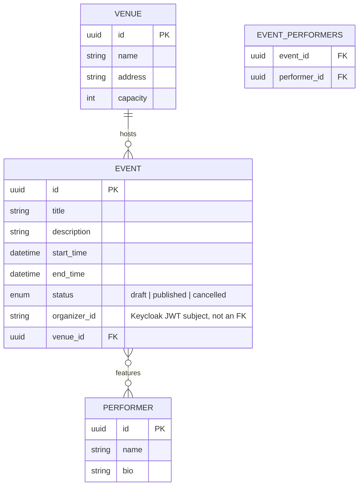

# Database Schema Design

*Status: draft, Event Service (Phase 1) and Search Service's Elasticsearch
index (Phase 2) evidence so far. `booking_db` and `payment_db` schemas are
added in later phases and will extend this chapter, not replace it.*

## `event_db` (Postgres) — ER diagram



**Cardinalities:**
- One `Venue` hosts many `Event`s (1:N) — an event has exactly one venue.
- `Event` and `Performer` are many-to-many, resolved through the
  `event_performers` join table (an event can feature multiple performers;
  a performer can appear at multiple events).
- `organizer_id` is **not** a foreign key into any local table — Event
  Service does not own a `users` table. It stores the Keycloak JWT
  `subject` claim verbatim and compares against it at write time (§15
  ownership scoping) rather than joining to identity data it doesn't own.

## Textual schema (Alembic-managed)

```
venues(id PK, name, address, capacity)
performers(id PK, name, bio NULL)
events(
  id PK, title, description NULL,
  start_time, end_time,
  status ENUM(draft, published, cancelled),
  organizer_id INDEXED,
  venue_id FK -> venues.id
)
event_performers(event_id FK -> events.id ON DELETE CASCADE,
                  performer_id FK -> performers.id ON DELETE CASCADE,
                  PRIMARY KEY(event_id, performer_id))
```

`organizer_id` is indexed (not unique) since ownership lookups
(`WHERE organizer_id = :subject`) are the write-path's dominant access
pattern once Phase 1's organizer dashboard-style queries land.

**Status:** Implemented, Tested. First migration (`f4b123adcbac`) applies
cleanly (`alembic upgrade head`) against a real Postgres instance;
downgrade-then-upgrade cycle verified clean (the Postgres `ENUM` type
required an explicit drop in `downgrade()` — autogenerate's default
downgrade only drops the table, not the type it depended on, which surfaced
as a `DuplicateObjectError` on re-upgrade until fixed). CRUD-verified live
via direct model creation, commit, fetch, and delete against the running
container.

## `event_service` (MongoDB) — seat-map document shape

Reserved/numbered seating only, per the architecture invariants — no
general-admission event ever exists in this system. One document per event:

```json
{
  "event_id": "<uuid string, matches events.id>",
  "sections": [
    {
      "name": "A",
      "rows": [
        {
          "name": "1",
          "seats": [
            { "label": "A1-1", "x": 0.0, "y": 0.0 },
            { "label": "A1-2", "x": 1.0, "y": 0.0 }
          ]
        }
      ]
    }
  ]
}
```

Chosen as a document-per-event rather than document-per-seat because a
seat map is always read and written as a whole unit (the organizer defines
it once, the customer-facing seat picker fetches it whole) — there is no
access pattern in this system that queries a single seat inside a seat map
in isolation from Event Service; that granularity belongs to Booking
Service's per-seat hold state (Phase 3), a different service with a
different datastore, not this one.

**Status:** Implemented, Tested. Validated at the API/repository boundary
via Pydantic (`SeatMap`/`SeatMapSection`/`SeatMapRow`/`Seat` in
`api/schemas.py`) before ever reaching MongoDB — malformed shapes are
rejected before a write is attempted, not caught downstream. Store/fetch/
delete round-trip verified live against a real MongoDB container.

## Search Service's Elasticsearch index (Phase 2)

Deliberately not a database in the schema sense above — no relations, no
migrations, no source-of-truth claim (§8). Included in this chapter anyway
because it's the third and final storage shape this system uses (relational
Postgres, document Mongo, search-index Elasticsearch), and the report
should show all three rather than silently dropping the one that isn't SQL.

```json
{
  "mappings": {
    "properties": {
      "event_id": { "type": "keyword" },
      "title": { "type": "text" },
      "description": { "type": "text" },
      "start_time": { "type": "date" },
      "end_time": { "type": "date" },
      "venue_name": { "type": "text" },
      "performer_names": { "type": "text" },
      "seats": {
        "type": "nested",
        "properties": {
          "section": { "type": "keyword" },
          "row": { "type": "keyword" },
          "label": { "type": "keyword" }
        }
      }
    }
  },
  "settings": { "number_of_replicas": 0 }
}
```

One document per event, indexed by event ID, entirely reconstructed from
the Kafka payload Event Service publishes (§7.2) — the mapping is a mirror
of that message shape, not an independent schema design. `number_of_replicas: 0`
is a deliberate consequence of the single-node local/demo topology (§12,
§24): a replica could never be assigned to a second node that doesn't
exist, so leaving the default of 1 would hold cluster health at `yellow`
forever for no reason.

**Status:** Implemented, Tested. Verified live: `GET /events/_mapping`
against the running index matches the mapping above; index created
idempotently on service boot (`HEAD` 404 → `PUT` 200 the first time,
`HEAD` 200 and no-op every time after).
