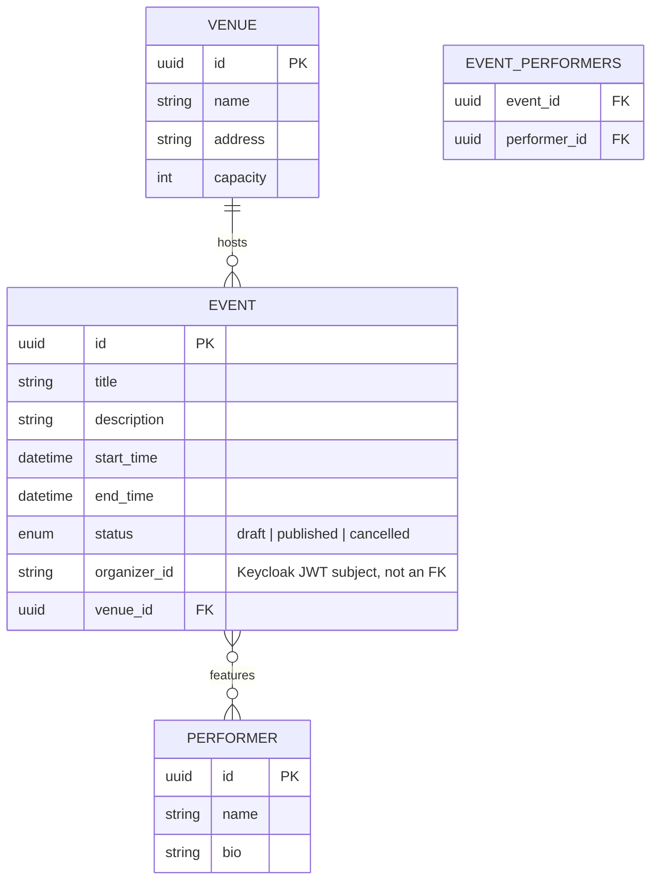
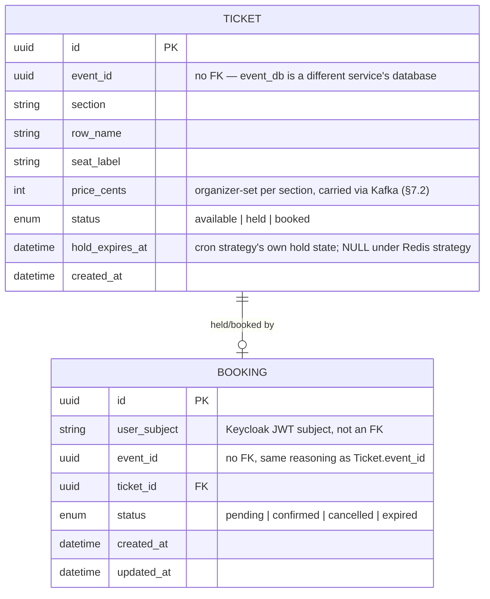
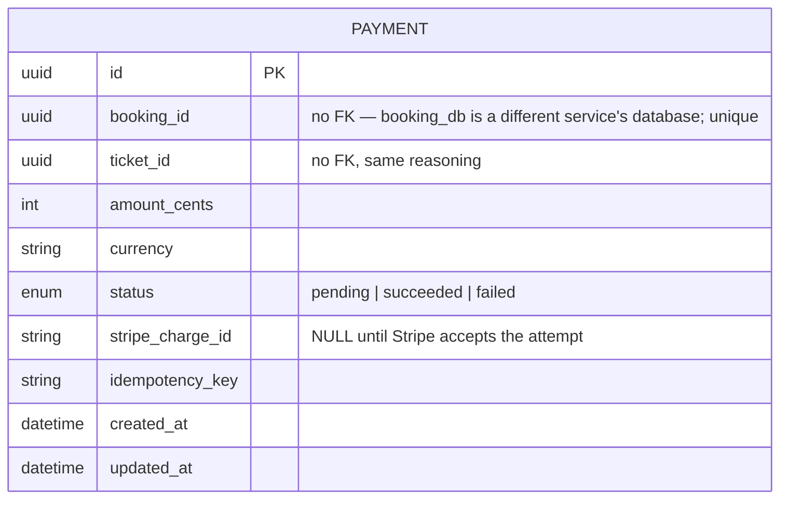

# Database Schema Design

*Status: draft, Event Service (Phase 1), Search Service's Elasticsearch
index (Phase 2), Booking Service's `booking_db` (Phase 3), and Payment
Service's `payment_db` (Phase 4) evidence so far.*

## `event_db` (Postgres) — ER diagram



**Cardinalities:**
- One `Venue` hosts many `Event`s (1:N) — an event has exactly one venue.
- `Event` and `Performer` are many-to-many, resolved through the
  `event_performers` join table (an event can feature multiple performers;
  a performer can appear at multiple events).
- `organizer_id` is **not** a foreign key into any local table — Event
  Service does not own a `users` table. It stores the Keycloak JWT
  `subject` claim verbatim and compares against it at write time (§15
  ownership scoping) rather than joining to identity data it doesn't own.

## Textual schema (Alembic-managed)

```
venues(id PK, name, address, capacity)
performers(id PK, name, bio NULL)
events(
  id PK, title, description NULL,
  start_time, end_time,
  status ENUM(draft, published, cancelled),
  organizer_id INDEXED,
  venue_id FK -> venues.id
)
event_performers(event_id FK -> events.id ON DELETE CASCADE,
                  performer_id FK -> performers.id ON DELETE CASCADE,
                  PRIMARY KEY(event_id, performer_id))
```

`organizer_id` is indexed (not unique) since ownership lookups
(`WHERE organizer_id = :subject`) are the write-path's dominant access
pattern once Phase 1's organizer dashboard-style queries land.

**Status:** Implemented, Tested. First migration (`f4b123adcbac`) applies
cleanly (`alembic upgrade head`) against a real Postgres instance;
downgrade-then-upgrade cycle verified clean (the Postgres `ENUM` type
required an explicit drop in `downgrade()` — autogenerate's default
downgrade only drops the table, not the type it depended on, which surfaced
as a `DuplicateObjectError` on re-upgrade until fixed). CRUD-verified live
via direct model creation, commit, fetch, and delete against the running
container.

## `event_service` (MongoDB) — seat-map document shape

Reserved/numbered seating only, per the architecture invariants — no
general-admission event ever exists in this system. One document per event:

```json
{
  "event_id": "<uuid string, matches events.id>",
  "sections": [
    {
      "name": "A",
      "rows": [
        {
          "name": "1",
          "price_cents": 5000,
      "seats": [
            { "label": "A1-1", "x": 0.0, "y": 0.0 },
            { "label": "A1-2", "x": 1.0, "y": 0.0 }
          ]
        }
      ]
    }
  ]
}
```

**Phase 4 addition:** each section carries an organizer-set `price_cents`
(decisions-log §9/§16 amendments) — per-section pricing (floor vs. balcony),
not a flat price per event. Schema-flexible by construction (MongoDB, §8),
so this needed no migration on the Mongo side; the one real migration cost
landed downstream, on `booking_db`'s `tickets` table below, since a Postgres
column has no equivalent "just add a field" option.

Chosen as a document-per-event rather than document-per-seat because a
seat map is always read and written as a whole unit (the organizer defines
it once, the customer-facing seat picker fetches it whole) — there is no
access pattern in this system that queries a single seat inside a seat map
in isolation from Event Service; that granularity belongs to Booking
Service's per-seat hold state (Phase 3), a different service with a
different datastore, not this one.

**Status:** Implemented, Tested. Validated at the API/repository boundary
via Pydantic (`SeatMap`/`SeatMapSection`/`SeatMapRow`/`Seat` in
`api/schemas.py`) before ever reaching MongoDB — malformed shapes are
rejected before a write is attempted, not caught downstream. Store/fetch/
delete round-trip verified live against a real MongoDB container.

## Search Service's Elasticsearch index (Phase 2)

Deliberately not a database in the schema sense above — no relations, no
migrations, no source-of-truth claim (§8). Included in this chapter anyway
because it's the third and final storage shape this system uses (relational
Postgres, document Mongo, search-index Elasticsearch), and the report
should show all three rather than silently dropping the one that isn't SQL.

```json
{
  "mappings": {
    "properties": {
      "event_id": { "type": "keyword" },
      "title": { "type": "text" },
      "description": { "type": "text" },
      "start_time": { "type": "date" },
      "end_time": { "type": "date" },
      "venue_name": { "type": "text" },
      "performer_names": { "type": "text" },
      "seats": {
        "type": "nested",
        "properties": {
          "section": { "type": "keyword" },
          "row": { "type": "keyword" },
          "label": { "type": "keyword" }
        }
      }
    }
  },
  "settings": { "number_of_replicas": 0 }
}
```

One document per event, indexed by event ID, entirely reconstructed from
the Kafka payload Event Service publishes (§7.2) — the mapping is a mirror
of that message shape, not an independent schema design. `number_of_replicas: 0`
is a deliberate consequence of the single-node local/demo topology (§12,
§24): a replica could never be assigned to a second node that doesn't
exist, so leaving the default of 1 would hold cluster health at `yellow`
forever for no reason.

**Status:** Implemented, Tested. Verified live: `GET /events/_mapping`
against the running index matches the mapping above; index created
idempotently on service boot (`HEAD` 404 → `PUT` 200 the first time,
`HEAD` 200 and no-op every time after).

## `booking_db` (Postgres) — ER diagram



**Cardinalities:** one `Ticket` has at most one *active* `Booking`
(`pending` or `confirmed`) at a time — enforced by a partial unique index
below, not just application logic — but can accumulate multiple
`Booking` rows over its lifetime (a cancelled or expired booking doesn't
block a later one for the same seat). `event_id` appears on both tables
as a **plain `UUID` column, never a `ForeignKey`**, on both — database-
per-service (§8) means `booking_db` cannot reference `event_db`'s tables
at the schema level; cross-service association is by value, carried in
via the Kafka payload (§7.2), not enforced by the database.

## Textual schema (Alembic-managed)

```
tickets(
  id PK, event_id INDEXED,
  section, row_name, seat_label,
  price_cents "added Phase 4, migration 9acd9bb8cc64",
  status ENUM(available, held, booked) INDEXED,
  hold_expires_at NULL,
  created_at,
  UNIQUE(event_id, section, row_name, seat_label)
)
bookings(
  id PK, user_subject INDEXED, event_id INDEXED,
  ticket_id FK -> tickets.id,
  status ENUM(pending, confirmed, cancelled, expired),
  created_at, updated_at,
  UNIQUE(ticket_id) WHERE status IN ('pending', 'confirmed')
)
```

Two constraints carry real correctness weight, not just data hygiene:

- **`UNIQUE(event_id, section, row_name, seat_label)` on `tickets`** is
  the entire idempotency mechanism for ticket provisioning (§7.2,
  integration point #2) — the provisioning consumer's
  `INSERT ... ON CONFLICT DO NOTHING` relies on this constraint existing;
  without it, a redelivered "event published" Kafka message would
  silently create duplicate seats.
- **The partial unique index `UNIQUE(ticket_id) WHERE status IN
  ('pending', 'confirmed')` on `bookings`** is defense-in-depth for the
  double-booking-critical path, independent of whichever
  `TicketHoldStrategy` (§6) is active — if a hold-acquisition race were
  ever won by two callers simultaneously (it isn't, per the concurrency
  suite below, but the constraint exists so that a bug here fails loudly
  at the database rather than silently double-booking a seat), the
  second `Booking` insert fails with an `IntegrityError`, which
  `BookingManager` catches and turns into a clean 409 plus a compensating
  hold release, not a distributed rollback (§8: no distributed
  transactions anywhere in this system).

**A consequence of the partial index worth stating plainly.** Because
`uq_bookings_active_ticket` treats `pending` as "active" regardless of *why*
a booking is still pending, a `Booking` row left `pending` forever — an
abandoned checkout whose hold was never explicitly released — permanently
blocks that seat from ever being booked again, independent of whether
`Ticket.status` itself ever changes. Under the cron strategy this can't
happen: `CronHoldStrategy.release_expired()` transitions the matching
`Booking` row to `expired` in the same sweep that frees the ticket. Found
during this phase's review: under the Redis strategy, nothing did this at
all — Redis's own key expiry frees the *lock*, but has no way to touch this
Postgres row, so an abandoned Redis-strategy checkout used to leave the seat
permanently unbookable. Fixed with an independent, age-based sweep
(`BookingRepository.expire_stale_pending()`, keyed on `created_at` vs.
`hold_ttl_seconds` rather than any `Ticket` column) — see the Class Diagrams
chapter's "Why this shape" section for the full mechanism and the Testing
Strategy chapter for how it was found and verified live.

`Ticket.status` carries different meaning depending on which hold
strategy is configured — see the Class Diagrams chapter's "Why this
shape" section for the full reasoning, stated once there rather than
duplicated here: it becomes `held` under the cron strategy specifically
(that transition *is* the strategy's lock), stays `available` under the
Redis strategy for the ticket's whole held lifetime (Redis's `SET NX EX`
is that strategy's lock instead), and both strategies write `booked`
identically once payment confirms in Phase 4.

**Phase 4's `price_cents` migration surfaced a real bug in an existing bind-
param-batching assumption**, not just a schema addition. `TicketRepository
.bulk_upsert_available`'s multi-row `INSERT` binds 7 params per row once
`price_cents` is added — 6 explicit columns plus `status`, whose Python-side
default SQLAlchemy still applies as a real bind param on a Core-level
`values()` insert even though it never appears in the row dict. A stale code
comment had undercounted this at 5 even before this phase (never accounting
for the `status` default at all); at the old `BIND_PARAM_SAFE_BATCH_SIZE` of
5000, `5000 × 7 = 35,000` overflows Postgres's ~32,767-bind-param cap.
Caught live by `tests/integration/test_provisioning_consumer.py`'s existing
6000-seat two-batch regression test, which started failing the moment
`price_cents` landed — not a hypothetical, a real green-to-red test result.
Fixed by lowering the shared constant (`app/db/chunking.py`) to 4000
(`4000 × 7 = 28,000`, safe with headroom) and correcting both stale
comments to state the real, now-verified param count.

**Status:** Implemented, Tested, Verified (live). Migration
(`2ab7ccc49f4d`) applies cleanly against a real Postgres instance; both
constraints verified live via direct duplicate-insert attempts against
the running `booking_db` (a second identical seat insert rejected with
`uq_ticket_event_seat`; a second `pending` booking against an already-held
ticket rejected with `uq_bookings_active_ticket`, while a `cancelled`
booking for the same ticket is correctly allowed through the partial
index). The no-double-booking claim itself — the reason this schema's
constraints exist — is proven under real concurrent load in
`tests/integration/test_concurrency_suite.py`: 25 clients racing one seat
under each hold strategy, exactly one `Booking` row results every time,
re-run repeatedly to rule out a false-positive pass rather than trusted
after a single green run.

## `payment_db` (Postgres) — ER diagram



**Cardinalities:** at most one `Payment` row per `booking_id`, enforced by a
unique index — not application logic alone. `booking_id`/`ticket_id` are
plain `UUID` columns, never `ForeignKey`s, same database-per-service
reasoning as every cross-service reference elsewhere in this schema (§8):
`payment_db` cannot reference `booking_db`'s tables at the schema level.
Unlike `event_id`/`ticket_id` elsewhere in this system, which arrive via
Kafka (§7.2), `booking_id`/`ticket_id`/`amount_cents` here arrive via the
one synchronous call in this system (decisions-log §9 amendment) — Booking
Service already holds all three locally when it calls in, so Payment
Service does no lookup of its own for any of them.

## Textual schema (Alembic-managed)

```
payments(
  id PK,
  booking_id UNIQUE INDEXED,
  ticket_id,
  amount_cents, currency,
  status ENUM(pending, succeeded, failed),
  stripe_charge_id NULL,
  idempotency_key,
  created_at, updated_at
)
```

**`UNIQUE(booking_id)` is defense-in-depth for the idempotency claim**, the
same role `uq_bookings_active_ticket` plays for `booking_db` — the primary
mechanism is application-level (`PaymentManager.create_charge` checks for
an existing row before ever calling Stripe, and Stripe's own
`idempotency_key` is a second backstop), but the constraint means a bug in
either of those layers fails loudly at the database with an
`IntegrityError` rather than silently creating two `Payment` rows for one
booking.

**`stripe_charge_id` being `NULL` is a meaningful, not incidental, state** —
it means a charge attempt was recorded locally but never actually reached
Stripe (a submission error, not a decline). This distinction is what a real
live-testing bug turned on this phase: `create_charge`'s idempotent
short-circuit originally checked "does a `Payment` row exist for this
booking" rather than "does a `Payment` row exist *with a `stripe_charge_id`
set*" — so a booking whose first attempt never reached Stripe could never
be retried, permanently stuck replaying the same `NULL`-charge-ID row.
Fixed to check `stripe_charge_id is not None` specifically; see the Class
Diagrams chapter's Payment Service section for the full mechanism and
`build-log.md`'s 2026-08-17 entry for how it was found.

**Status:** Implemented, Tested, Verified (live, except the final real-Stripe
leg). Migration (`afbcf34047ba`) applies cleanly against a real Postgres
instance. The unique-`booking_id` constraint and the idempotency logic in
front of it both verified live: a second `/pay` call against the same
booking after a failed Stripe submission correctly re-attempted Stripe
(post-fix) rather than silently replaying the stale row, and a second call
against a booking Stripe had genuinely accepted would return the same
`Payment` row without a second Stripe call (proven by unit and integration
test with a mocked/real-Postgres `stripe_charge_id` already set — not
reproducible live this session without real Stripe credentials, see the
Class Diagrams chapter for the tracked gap). Webhook idempotency
(`handle_webhook_event` only transitioning a still-`pending` row) proven
both by test and, for the Kafka side it feeds, live against the real
running stack: a redelivered `payment.outcomes` message produced no second
effect.
