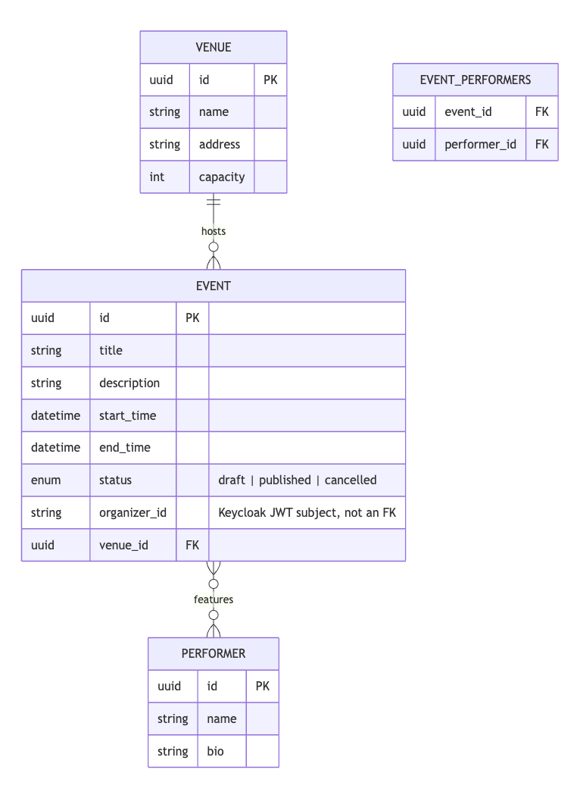
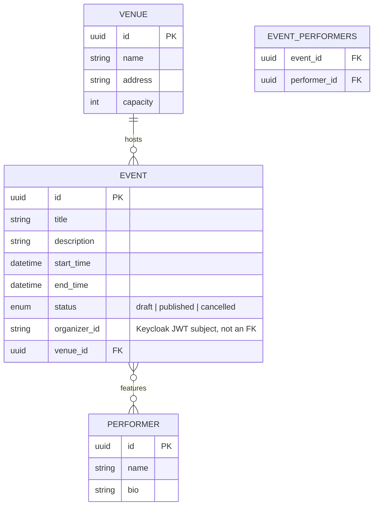
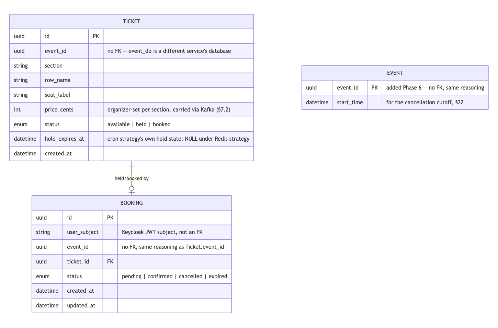
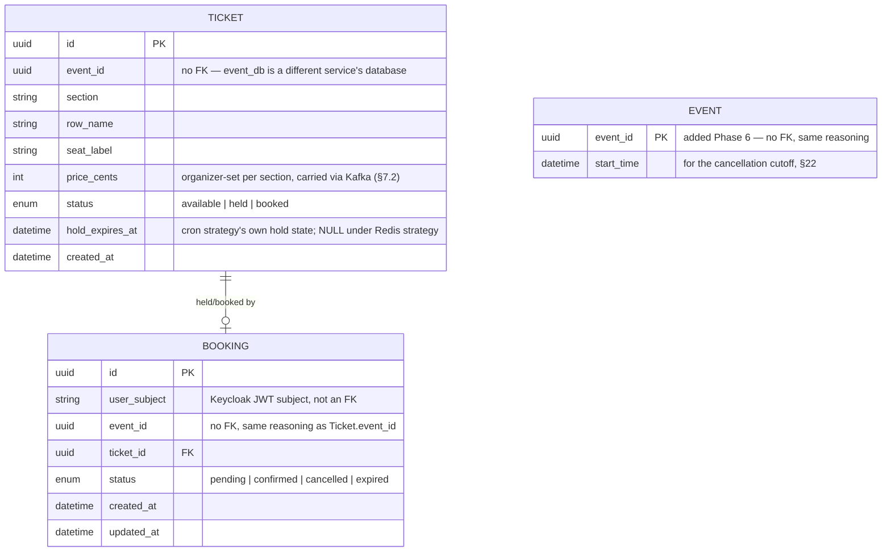
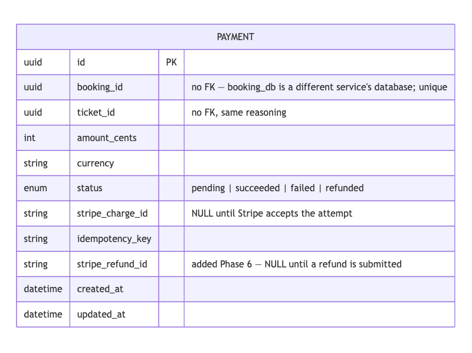
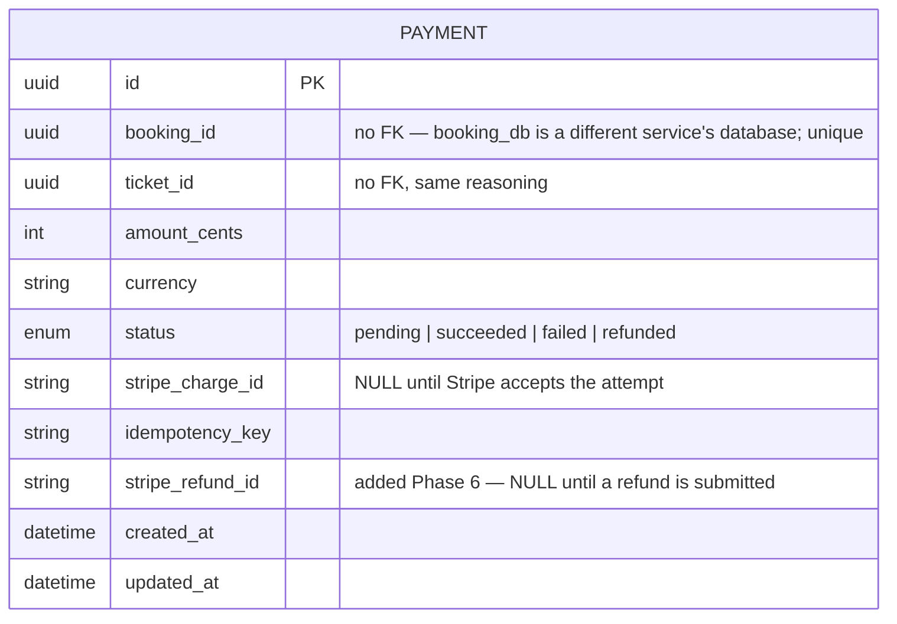

# Database Schema Design

*Status: draft — all five backend services covered (Event Service's
`event_db`/seat-map Mongo docs, Search Service's Elasticsearch index,
Booking Service's `booking_db`, Payment Service's `payment_db`, and
Notification Service's deliberate absence of a schema of its own). Each
Postgres ER diagram below is rendered to a static PNG (embedded inline)
and a vector SVG (`assets/diagrams/db-*.svg`) from its Mermaid source,
ready to insert directly into the formatted submission. Condensed
2026-08-25 (report trim, phase 4): prose tightened to its essential
schema fact, no constraint name, migration ID, column, number, or
verification claim removed.*

## `event_db` (Postgres) — ER diagram



*Rendered from this project's Mermaid diagram source (`assets/diagrams/db-event_db.svg`
for a vector version).*



**Cardinalities:**
- One `Venue` hosts many `Event`s (1:N) — an event has exactly one venue.
- `Event` and `Performer` are many-to-many, resolved through the
  `event_performers` join table.
- `organizer_id` is **not** a foreign key — Event Service does not own a
  `users` table. It stores the Keycloak JWT `subject` claim verbatim and
  compares against it at write time (§15 ownership scoping) rather than
  joining to identity data it doesn't own.

## Textual schema (Alembic-managed)

```
venues(id PK, name, address, capacity)
performers(id PK, name, bio NULL)
events(
  id PK, title, description NULL,
  start_time, end_time,
  status ENUM(draft, published, cancelled),
  organizer_id INDEXED,
  venue_id FK -> venues.id
)
event_performers(event_id FK -> events.id ON DELETE CASCADE,
                  performer_id FK -> performers.id ON DELETE CASCADE,
                  PRIMARY KEY(event_id, performer_id))
```

`organizer_id` is indexed (not unique) since ownership lookups
(`WHERE organizer_id = :subject`) are the write-path's dominant access
pattern.

**Status:** Implemented, Tested. First migration (`f4b123adcbac`) applies
cleanly (`alembic upgrade head`); downgrade-then-upgrade cycle verified
clean (the Postgres `ENUM` type needed an explicit drop in `downgrade()`
— autogenerate's default only drops the table, not the type, which
surfaced as `DuplicateObjectError` on re-upgrade until fixed).
CRUD-verified live via direct model creation, commit, fetch, and delete
against the running container.

## `event_service` (MongoDB) — seat-map document shape

Reserved/numbered seating only — no general-admission event exists in
this system. One document per event:

```json
{
  "event_id": "<uuid string, matches events.id>",
  "sections": [
    {
      "name": "A",
      "rows": [
        {
          "name": "1",
          "price_cents": 5000,
      "seats": [
            { "label": "A1-1", "x": 0.0, "y": 0.0 },
            { "label": "A1-2", "x": 1.0, "y": 0.0 }
          ]
        }
      ]
    }
  ]
}
```

**Phase 4 addition:** each section carries an organizer-set `price_cents`
(§9/§16 amendments) — per-section pricing, not a flat price per event.
Schema-flexible by construction, so this needed no migration on the Mongo
side; the migration cost landed downstream on `booking_db`'s `tickets`
table below.

Chosen as document-per-event rather than document-per-seat because a seat
map is always read and written as a whole unit — there is no access
pattern here that queries a single seat in isolation; that granularity
belongs to Booking Service's per-seat hold state (Phase 3), a different
service and datastore.

**Status:** Implemented, Tested. Validated at the API/repository boundary
via Pydantic (`SeatMap`/`SeatMapSection`/`SeatMapRow`/`Seat`) before ever
reaching MongoDB. Store/fetch/delete round-trip verified live against a
real MongoDB container.

## Search Service's Elasticsearch index (Phase 2)

Deliberately not a database in the schema sense above — no relations, no
migrations, no source-of-truth claim (§8). Included anyway as the third
storage shape this system uses (relational, document, search-index).

```json
{
  "mappings": {
    "properties": {
      "event_id": { "type": "keyword" },
      "title": { "type": "text" },
      "description": { "type": "text" },
      "start_time": { "type": "date" },
      "end_time": { "type": "date" },
      "venue_name": { "type": "text" },
      "performer_names": { "type": "text" },
      "seats": {
        "type": "nested",
        "properties": {
          "section": { "type": "keyword" },
          "row": { "type": "keyword" },
          "label": { "type": "keyword" }
        }
      }
    }
  },
  "settings": { "number_of_replicas": 0 }
}
```

One document per event, indexed by event ID, entirely reconstructed from
the Kafka payload Event Service publishes (§7.2) — the mapping mirrors
that message, not an independent design. `number_of_replicas: 0` is a
deliberate consequence of the single-node topology (§12, §24): a replica
could never be assigned to a second node that doesn't exist.

**Status:** Implemented, Tested. Verified live: `GET /events/_mapping`
matches the mapping above; index created idempotently on service boot
(`HEAD` 404 → `PUT` 200 the first time, `HEAD` 200 and no-op every time
after).

## `booking_db` (Postgres) — ER diagram



*Rendered from this project's Mermaid diagram source (`assets/diagrams/db-booking_db.svg`
for a vector version).*



**Cardinalities:** one `Ticket` has at most one *active* `Booking`
(`pending` or `confirmed`) at a time — enforced by a partial unique index
below, not just application logic — but can accumulate multiple `Booking`
rows over its lifetime (a cancelled or expired booking doesn't block a
later one for the same seat). `event_id` appears on both tables as a
**plain `UUID` column, never a `ForeignKey`** — database-per-service (§8)
means `booking_db` cannot reference `event_db`'s tables at the schema
level; cross-service association is by value, carried via Kafka (§7.2).

## Textual schema (Alembic-managed)

```
tickets(
  id PK, event_id INDEXED,
  section, row_name, seat_label,
  price_cents "added Phase 4, migration 9acd9bb8cc64",
  status ENUM(available, held, booked) INDEXED,
  hold_expires_at NULL,
  created_at,
  UNIQUE(event_id, section, row_name, seat_label)
)
bookings(
  id PK, user_subject INDEXED, event_id INDEXED,
  ticket_id FK -> tickets.id,
  status ENUM(pending, confirmed, cancelled, expired),
  created_at, updated_at,
  UNIQUE(ticket_id) WHERE status IN ('pending', 'confirmed')
)
events(
  event_id PK "added Phase 6, migration 3cabba382c63",
  start_time
)
```

**`events` (Phase 6) is deliberately minimal** — not a copy of Event
Service's own data (cross-service table duplication beyond what's needed,
§8), just the one field `cancel_booking` needs to enforce the "before the
event starts" cutoff (§22). Written by `ProvisioningConsumer` from the
same `EventUpsertedMessage.start_time` field already received (and
previously discarded) for ticket provisioning — no new Kafka integration
point. Upserted (`ON CONFLICT (event_id) DO UPDATE`), so a republished
event's corrected `start_time` stays current.

Two constraints carry real correctness weight, not just data hygiene:

- **`UNIQUE(event_id, section, row_name, seat_label)` on `tickets`** is
  the entire idempotency mechanism for ticket provisioning (§7.2,
  integration point #2) — the provisioning consumer's `INSERT ... ON
  CONFLICT DO NOTHING` relies on it; without it, a redelivered "event
  published" Kafka message would silently create duplicate seats.
- **The partial unique index `UNIQUE(ticket_id) WHERE status IN
  ('pending', 'confirmed')` on `bookings`** is defense-in-depth for the
  double-booking-critical path, independent of whichever
  `TicketHoldStrategy` (§6) is active — the concurrency suite below
  confirms a hold-acquisition race is never won by two callers
  simultaneously, but the constraint exists so a bug here fails loudly at
  the database rather than silently double-booking a seat: the second
  `Booking` insert fails with `IntegrityError`, which `BookingManager`
  catches and turns into a clean 409 plus a compensating hold release, not
  a distributed rollback (§8: no distributed transactions in this system).

**A consequence of the partial index:** because `uq_bookings_active_ticket`
treats `pending` as "active" regardless of *why*, a `Booking` row left
`pending` forever — an abandoned checkout whose hold was never explicitly
released — permanently blocks that seat, independent of `Ticket.status`.
Under the cron strategy this can't happen:
`CronHoldStrategy.release_expired()` transitions the matching `Booking`
row to `expired` in the same sweep that frees the ticket. The Redis
strategy needed a separate fix for this exact gap — see the Class
Diagrams chapter's "Why this shape" section for the finding and the
resulting `BookingRepository.expire_stale_pending()` mechanism.

`Ticket.status` carries different meaning per hold strategy — see Class
Diagrams for the full reasoning: `held` under cron (that transition *is*
the strategy's lock), stays `available` under Redis for the ticket's
whole held lifetime (Redis's `SET NX EX` is that strategy's lock
instead), and both strategies write `booked` identically once payment
confirms in Phase 4.

**Phase 4's `price_cents` migration exposed a latent bind-param-batching
bug, not just a schema addition.** The sixth column pushed
`TicketRepository.bulk_upsert_available`'s per-row bind-param count to 7
— 6 explicit columns plus `status`, whose Python-side default SQLAlchemy
still applies as a real bind param on a Core-level `values()` insert even
though it never appears in the row dict — overflowing Postgres's
~32,767-bind-param cap at the previous `BIND_PARAM_SAFE_BATCH_SIZE` of
5000 (`5000 × 7 = 35,000`). Caught live by an existing regression test
flipping from green to red the moment the column landed. Fixed by
lowering the shared constant (`app/db/chunking.py`) to 4000
(`4000 × 7 = 28,000`, safe with headroom) and correcting a stale comment
that had undercounted the param count even before this phase.

**Status:** Implemented, Tested, Verified (live). Migration
(`2ab7ccc49f4d`) applies cleanly; both constraints verified live via
direct duplicate-insert attempts against the running `booking_db` (a
second identical seat insert rejected with `uq_ticket_event_seat`; a
second `pending` booking against an already-held ticket rejected with
`uq_bookings_active_ticket`, while a `cancelled` booking for the same
ticket is correctly allowed through the partial index). The
no-double-booking claim itself is proven under real concurrent load in
`tests/integration/test_concurrency_suite.py`: 25 clients racing one seat
under each hold strategy, exactly one `Booking` row results every time,
re-run repeatedly to rule out a false-positive pass.

## `payment_db` (Postgres) — ER diagram



*Rendered from this project's Mermaid diagram source (`assets/diagrams/db-payment_db.svg`
for a vector version).*



**Cardinalities:** at most one `Payment` row per `booking_id`, enforced by
a unique index, not application logic alone. `booking_id`/`ticket_id` are
plain `UUID` columns, never `ForeignKey`s, same database-per-service
reasoning as elsewhere (§8). Unlike `event_id`/`ticket_id` elsewhere,
which arrive via Kafka (§7.2), `booking_id`/`ticket_id`/`amount_cents`
here arrive via the one synchronous call in this system (§9 amendment) —
Booking Service already holds all three locally, so Payment Service does
no lookup of its own.

## Textual schema (Alembic-managed)

```
payments(
  id PK,
  booking_id UNIQUE INDEXED,
  ticket_id,
  amount_cents, currency,
  status ENUM(pending, succeeded, failed, refunded "refunded added Phase 6"),
  stripe_charge_id NULL,
  idempotency_key,
  stripe_refund_id NULL "added Phase 6, migration 0c1c541204d5",
  created_at, updated_at
)
```

**Adding `refunded` to the existing Postgres `ENUM` type needed its own
migration step** — `ALTER TYPE paymentstatus ADD VALUE` cannot share a
transaction with a statement that uses the new value, so migration
`0c1c541204d5` runs it inside its own
`op.get_context().autocommit_block()`, separate from the
`stripe_refund_id` column addition in the same file.

**`UNIQUE(booking_id)` is defense-in-depth for the idempotency claim**,
the same role `uq_bookings_active_ticket` plays for `booking_db` — the
primary mechanism is application-level (`PaymentManager.create_charge`
checks for an existing row before ever calling Stripe, and Stripe's own
`idempotency_key` is a second backstop), but the constraint means a bug
in either layer fails loudly with an `IntegrityError` rather than
silently creating two `Payment` rows for one booking.

**`stripe_charge_id` being `NULL` is a meaningful, not incidental, state**
— it means a charge attempt was recorded locally but never actually
reached Stripe (a submission error, not a decline). A live-testing bug
this phase turned on exactly that distinction: `create_charge`'s
idempotent short-circuit originally didn't check it, so a booking whose
first attempt never reached Stripe could never be retried — fixed to
check `stripe_charge_id is not None` specifically.

**Status:** Implemented, Tested, Verified (live, except the final
real-Stripe leg). Migration (`afbcf34047ba`) applies cleanly. The
unique-`booking_id` constraint and the idempotency logic in front of it
both verified live: a second `/pay` call against the same booking after a
failed Stripe submission correctly re-attempted Stripe (post-fix) rather
than silently replaying the stale row, and a second call against a
booking Stripe had genuinely accepted returned the same `Payment` row
without a second Stripe call (proven by unit and integration test with a
mocked/real-Postgres `stripe_charge_id` already set — not reproducible
live this session without real Stripe credentials, see Class Diagrams for
the tracked gap). Webhook idempotency
(`handle_webhook_event` only transitioning a still-`pending` row) proven
both by test and live: a redelivered `payment.outcomes` message produced
no second effect. **Hardened further at CHECKPOINT**: the transition is
now a rowcount-gated conditional `UPDATE`
(`PaymentRepository.transition_if_pending`) rather than a read-then-write
check, closing a race where two genuinely overlapping webhook deliveries
could both pass the guard before either committed — proven with a
concurrency integration test racing two real, independent sessions
against the same delivery. The same review also moved the Kafka publish
ahead of the status commit, since the original order could strand an
outcome permanently if the publish itself failed. See the Class Diagrams
chapter's Payment Service section and `build-log.md`'s 2026-08-17
CHECKPOINT entry for the full account, including the more severe
authorization-bypass finding from the same review pass.

**Phase 6: `stripe_refund_id` follows `stripe_charge_id`'s exact "`NULL`
means not yet submitted" role**, deliberately, rather than a new
mechanism — `refund_payment` resubmits to Stripe only while this column
is `NULL`, mirroring `create_charge`'s already-reviewed resubmission
gate. **Status:** Implemented, Tested, Verified (live, except a real
refund succeeding against Stripe's API). Migration applies cleanly.
Live-verified through the real HTTP/Kafka path: a cancelled,
previously-`SUCCEEDED` booking reached a genuine `POST
https://api.stripe.com/v1/refunds` call, failing only at the same
placeholder-key boundary Phase 4's charge flow hits (401, not a bypass);
`status` confirmed to stay `SUCCEEDED` and `stripe_refund_id` `NULL`
after the failed attempt, not silently flipped to any terminal-looking
state, matching the explicit no-rollback scope boundary in §22. A
hand-crafted redelivery of the same `booking.cancelled` message correctly
re-attempted the refund (since it hadn't yet succeeded); the true
already-refunded-redelivery no-op case is proven in the automated
integration suite with a mocked Stripe success, not reproducible live
without real credentials.

## Notification Service — deliberately no schema (Phase 5)

The one service with no database of any kind — not a smaller schema, an
absent one, a documented decision rather than an oversight (§17
amendment, 2026-08-18). `NotificationManager.deliver` writes nothing
anywhere; the delivery *is* the structured log line it emits (§19 — no
real email/SMS provider exists to persist a delivery record about). The
one piece of state a datastore would normally hold — attempt count, last
error — instead rides on the Kafka message itself: `RetryEnvelope
{ attempt: int, original: NotificationMessage, last_error: str }`,
round-tripped through three topics (`notifications` →
`notification-retry` → `notification-dlq`) rather than read from and
written back to a table row. This is the schema-design version of the
same trade-off the dual hold strategies made explicit for Booking Service
in Phase 3 (§6) — state can live somewhere other than a database row when
the access pattern doesn't need one, as long as the choice is argued and
recorded.

**Status:** Implemented, Tested, Verified (live) — confirmed by absence:
no `db/` folder, no SQLAlchemy models, no Alembic migration exist
anywhere under `services/notification-service/`, and the service boots
and serves real traffic without one. See the Class Diagrams chapter's
Notification Service section for the full `RetryEnvelope` shape and
retry-ladder mechanism.

## Phase 7 — no new schema, one new column-free query

The frontend introduces no schema of its own — a static build with no
datastore, the same "no store" case Notification Service already
established. The one backend addition, `GET
/bookings/events/{event_id}/tickets`, adds no table, column, or
migration to `booking_db` — a plain `SELECT` against the existing
`tickets` table (`TicketRepository.list_by_event`), filtered by an
already-indexed column (`event_id`, indexed since Phase 3). See the Class
Diagrams chapter's Phase 7 section for the method itself.
